# Taboos and Self-Censorship, Revisited


# Belief in Controversial Statements and Reluctance to Express Beliefs

## Reproducing Figure 1

``` r
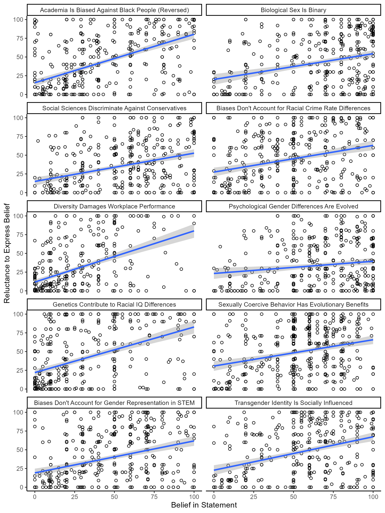
```


## Mixed Effects Models

### Unconditional Model

``` r
summary(lmm_sc_00)
```

    Linear mixed model fit by REML. t-tests use Satterthwaite's method [
    lmerModLmerTest]
    Formula: self_censor ~ 1 + (1 | id) + (1 | statement)
       Data: taboo_long_rev
    Control: lmerControl(optimizer = "bobyqa")

    REML criterion at convergence: 41855.1

    Scaled residuals: 
        Min      1Q  Median      3Q     Max 
    -4.0143 -0.5865 -0.0554  0.6095  3.6681 

    Random effects:
     Groups    Name        Variance Std.Dev.
     id        (Intercept) 620.24   24.905  
     statement (Intercept)  45.87    6.773  
     Residual              563.06   23.729  
    Number of obs: 4438, groups:  id, 468; statement, 10

    Fixed effects:
                Estimate Std. Error     df t value Pr(>|t|)    
    (Intercept)   39.844      2.462 14.833   16.19 7.82e-11 ***
    ---
    Signif. codes:  0 '***' 0.001 '**' 0.01 '*' 0.05 '.' 0.1 ' ' 1

``` r
icc_sc_00
```

    # ICC by Group

    Group     |   ICC
    -----------------
    id        | 0.505
    statement | 0.037

### Linear Effect of Belief

``` r
summary(lmm_sc_01)
```

    Linear mixed model fit by REML. t-tests use Satterthwaite's method [
    lmerModLmerTest]
    Formula: self_censor ~ 1 + belief + (1 + belief | id) + (1 + belief |  
        statement)
       Data: taboo_long_rev
    Control: lmerControl(optimizer = "bobyqa")

    REML criterion at convergence: 41191.8

    Scaled residuals: 
        Min      1Q  Median      3Q     Max 
    -3.6977 -0.5486 -0.0622  0.5418  3.5978 

    Random effects:
     Groups    Name        Variance  Std.Dev. Corr 
     id        (Intercept) 491.72786 22.1749       
               belief        0.06807  0.2609  -0.25
     statement (Intercept)  39.78881  6.3078       
               belief        0.02845  0.1687  -0.72
     Residual              455.39076 21.3399       
    Number of obs: 4433, groups:  id, 468; statement, 10

    Fixed effects:
                Estimate Std. Error      df t value Pr(>|t|)    
    (Intercept)  27.7955     2.3789 14.9840  11.684 6.29e-09 ***
    belief        0.3050     0.0567 10.3141   5.379 0.000279 ***
    ---
    Signif. codes:  0 '***' 0.001 '**' 0.01 '*' 0.05 '.' 0.1 ' ' 1

    Correlation of Fixed Effects:
           (Intr)
    belief -0.667
    optimizer (bobyqa) convergence code: 0 (OK)
    Model is nearly unidentifiable: very large eigenvalue
     - Rescale variables?

``` r
r2_sc_01
```

    # R2 for Mixed Models

      Conditional R2: 0.617
         Marginal R2: 0.079

#### Removing Random Slopes

It makes little sense to remove the random slopes from this model, but
why not have a look?

``` r
summary(lmm_sc_red)
```

    Linear mixed model fit by REML. t-tests use Satterthwaite's method [
    lmerModLmerTest]
    Formula: self_censor ~ 1 + belief + (1 | id) + (1 | statement)
       Data: taboo_long_rev
    Control: lmerControl(optimizer = "bobyqa")

    REML criterion at convergence: 41486.4

    Scaled residuals: 
        Min      1Q  Median      3Q     Max 
    -3.4486 -0.5937 -0.0305  0.5808  3.7711 

    Random effects:
     Groups    Name        Variance Std.Dev.
     id        (Intercept) 517.94   22.758  
     statement (Intercept)  39.16    6.258  
     Residual              528.83   22.996  
    Number of obs: 4433, groups:  id, 468; statement, 10

    Fixed effects:
                 Estimate Std. Error        df t value Pr(>|t|)    
    (Intercept) 2.675e+01  2.377e+00 1.757e+01   11.25 1.86e-09 ***
    belief      2.767e-01  1.483e-02 4.203e+03   18.66  < 2e-16 ***
    ---
    Signif. codes:  0 '***' 0.001 '**' 0.01 '*' 0.05 '.' 0.1 ' ' 1

    Correlation of Fixed Effects:
           (Intr)
    belief -0.295

``` r
r2_sc_red
```

    # R2 for Mixed Models

      Conditional R2: 0.546
         Marginal R2: 0.067

### Polynomial Effect of Belief

``` r
summary(lmm_sc_pl)
```

    Linear mixed model fit by REML. t-tests use Satterthwaite's method [
    lmerModLmerTest]
    Formula: self_censor ~ 1 + poly(belief, 2) + (1 + poly(belief, 2) | id) +  
        (1 + poly(belief, 2) | statement)
       Data: taboo_long_rev %>% filter(complete.cases(.))
    Control: lmerControl(optimizer = "bobyqa")

    REML criterion at convergence: 40855.4

    Scaled residuals: 
        Min      1Q  Median      3Q     Max 
    -4.0603 -0.5308 -0.0389  0.5031  3.8668 

    Random effects:
     Groups    Name             Variance  Std.Dev. Corr       
     id        (Intercept)         487.22  22.073             
               poly(belief, 2)1 279081.86 528.282   0.48      
               poly(belief, 2)2  63231.61 251.459  -0.48 -0.38
     statement (Intercept)          32.16   5.671             
               poly(belief, 2)1  30746.48 175.347   0.66      
               poly(belief, 2)2   9126.37  95.532  -0.02  0.18
     Residual                      418.51  20.458             
    Number of obs: 4433, groups:  id, 468; statement, 10

    Fixed effects:
                     Estimate Std. Error       df t value Pr(>|t|)    
    (Intercept)        39.919      2.104   15.724  18.975 2.94e-12 ***
    poly(belief, 2)1  627.299     68.055   13.818   9.218 2.82e-07 ***
    poly(belief, 2)2 -496.911     43.175   14.788 -11.509 8.90e-09 ***
    ---
    Signif. codes:  0 '***' 0.001 '**' 0.01 '*' 0.05 '.' 0.1 ' ' 1

    Correlation of Fixed Effects:
                (Intr) p(,2)1
    ply(blf,2)1  0.552       
    ply(blf,2)2 -0.041  0.093

``` r
r2_sc_pl
```

    # R2 for Mixed Models

      Conditional R2: 0.642
         Marginal R2: 0.124

``` r
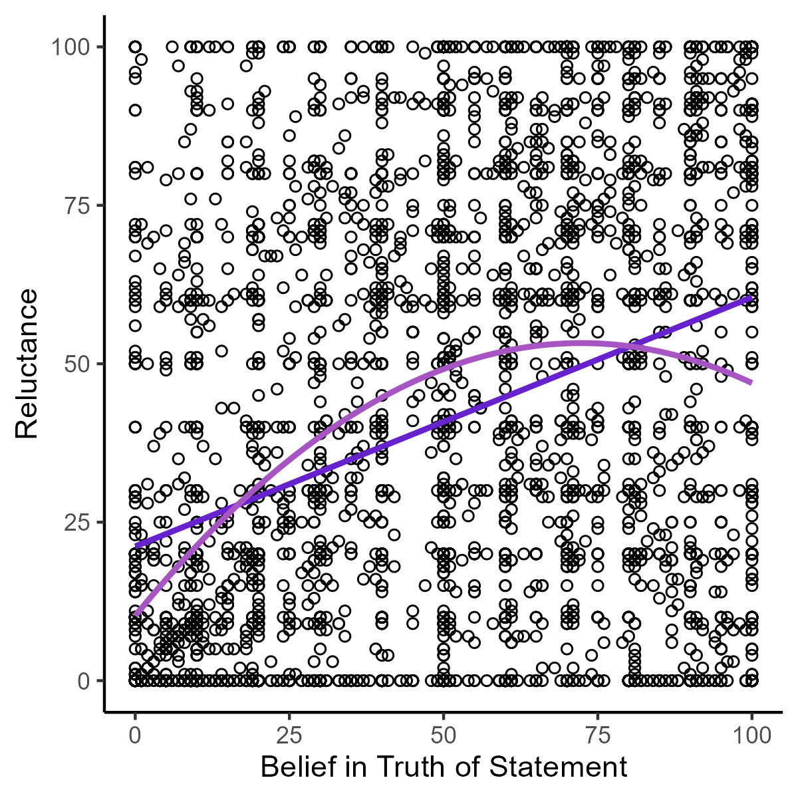
```


## Latent Class Mixed Models

### Polynomial

``` r
summary(lcmm_sc_p1)
```

    Heterogenous linear mixed model 
         fitted by maximum likelihood method 
     
    hlme(fixed = self_censor ~ poly(belief, 2), random = ~statement, 
        subject = "id_1", ng = 1, data = taboo_long_rev %>% filter(complete.cases(.)))
     
    Statistical Model: 
         Dataset: taboo_long_rev %>% filter(complete.cases(.)) 
         Number of subjects: 468 
         Number of observations: 4433 
         Number of latent classes: 1 
         Number of parameters: 59  
     
    Iteration process: 
         Maximum number of iteration reached without convergence 
         Number of iterations:  500 
         Convergence criteria: parameters= 0.00011 
                             : likelihood= 0.0011 
                             : second derivatives= 1 
     
    Goodness-of-fit statistics: 
         maximum log-likelihood: -20475.62  
         AIC: 41069.25  
         BIC: 41314  
     
     
    Maximum Likelihood Estimates: 
     
    Fixed effects in the longitudinal model:

                           coef Se Wald p-value
    intercept          37.23081                
    poly(belief, 2)1  507.80337                
    poly(belief, 2)2 -457.02309                


    Variance-covariance matrix of the random-effects:
                      intercept statementBinary statementCons statementCrime
    intercept         851.62470                                             
    statementBinary  -222.38533        445.7971                             
    statementCons    -463.57306        343.2914     682.08508               
    statementCrime    -40.58921        128.9678     100.99614       74.65372
    statementDivers  -431.17594        237.1645     434.42868      124.34058
    statementMFEvo   -457.59119        400.5266     621.26704      154.02189
    statementRaceIQ  -160.12508        160.0969      89.38113      130.86726
    statementSCBEvo  -370.49491        275.6439     306.55007       96.03738
    statementSTEM    -185.69520        185.6830     179.69175       90.46308
    statementTransSI -232.94454        444.6836     276.02816      142.52335
                     statementDivers statementMFEvo statementRaceIQ statementSCBEvo
    intercept                                                                      
    statementBinary                                                                
    statementCons                                                                  
    statementCrime                                                                 
    statementDivers         502.1082                                               
    statementMFEvo          433.1337       738.2744                                
    statementRaceIQ         224.1303       140.1324        437.3333                
    statementSCBEvo         256.7188       333.3846        166.4246        631.2896
    statementSTEM           195.5309       279.7978        124.0962        193.1051
    statementTransSI        260.2096       379.0231        190.8808        289.4610
                     statementSTEM statementTransSI
    intercept                                      
    statementBinary                                
    statementCons                                  
    statementCrime                                 
    statementDivers                                
    statementMFEvo                                 
    statementRaceIQ                                
    statementSCBEvo                                
    statementSTEM         290.8922                 
    statementTransSI      155.3507         501.0917

                                   coef Se
    Residual standard error:   16.65112   

``` r
summary(lcmm_sc_p2)
```

    Heterogenous linear mixed model 
         fitted by maximum likelihood method 
     
    hlme(fixed = self_censor ~ poly(belief, 2), mixture = ~poly(belief, 
        2), random = ~statement, subject = "id_1", ng = 2, data = taboo_long_rev %>% 
        filter(complete.cases(.)))
     
    Statistical Model: 
         Dataset: taboo_long_rev %>% filter(complete.cases(.)) 
         Number of subjects: 468 
         Number of observations: 4433 
         Number of latent classes: 2 
         Number of parameters: 63  
     
    Iteration process: 
         Maximum number of iteration reached without convergence 
         Number of iterations:  500 
         Convergence criteria: parameters= 0.002 
                             : likelihood= 0.002 
                             : second derivatives= 1 
     
    Goodness-of-fit statistics: 
         maximum log-likelihood: -20384.68  
         AIC: 40895.36  
         BIC: 41156.72  
     
     
    Maximum Likelihood Estimates: 
     
    Fixed effects in the class-membership model:
    (the class of reference is the last class) 

                           coef Se Wald p-value
    intercept class1    0.18759                

    Fixed effects in the longitudinal model:

                            coef Se Wald p-value
    intercept class1    25.71105                
    intercept class2    50.32923                
    poly(...)1 class1  141.73493                
    poly(...)1 class2 1058.86262                
    poly(...)2 class1 -383.21778                
    poly(...)2 class2 -637.58617                


    Variance-covariance matrix of the random-effects:
                      intercept statementBinary statementCons statementCrime
    intercept         686.20509                                             
    statementBinary  -275.66572        421.4149                             
    statementCons    -461.39821        347.8938     695.01338               
    statementCrime    -86.91965        140.6330     128.76791       107.9742
    statementDivers  -342.50590        248.5769     409.12468       138.4447
    statementMFEvo   -496.38697        382.3845     617.01353       168.0337
    statementRaceIQ  -138.25809        179.8370      82.92607       184.1318
    statementSCBEvo  -378.77530        269.0978     313.00469       111.9856
    statementSTEM    -216.74244        182.0754     210.04761       105.7753
    statementTransSI -275.53276        413.7649     267.62463       144.9370
                     statementDivers statementMFEvo statementRaceIQ statementSCBEvo
    intercept                                                                      
    statementBinary                                                                
    statementCons                                                                  
    statementCrime                                                                 
    statementDivers         408.6279                                               
    statementMFEvo          421.8172       722.7194                                
    statementRaceIQ         192.0176       136.5117        428.2538                
    statementSCBEvo         258.4009       306.2617        162.4727        621.9745
    statementSTEM           195.7775       279.0151        131.7811        211.1590
    statementTransSI        274.4416       355.0269        205.7911        268.4421
                     statementSTEM statementTransSI
    intercept                                      
    statementBinary                                
    statementCons                                  
    statementCrime                                 
    statementDivers                                
    statementMFEvo                                 
    statementRaceIQ                                
    statementSCBEvo                                
    statementSTEM         318.1323                 
    statementTransSI      150.6551         468.4286

                                   coef Se
    Residual standard error:   15.77588   

``` r
summary(lcmm_sc_p3)
```

    Heterogenous linear mixed model 
         fitted by maximum likelihood method 
     
    hlme(fixed = self_censor ~ poly(belief, 2), mixture = ~poly(belief, 
        2), random = ~statement, subject = "id_1", ng = 3, data = taboo_long_rev %>% 
        filter(complete.cases(.)))
     
    Statistical Model: 
         Dataset: taboo_long_rev %>% filter(complete.cases(.)) 
         Number of subjects: 468 
         Number of observations: 4433 
         Number of latent classes: 3 
         Number of parameters: 67  
     
    Iteration process: 
         Maximum number of iteration reached without convergence 
         Number of iterations:  500 
         Convergence criteria: parameters= 0.033 
                             : likelihood= 0.0012 
                             : second derivatives= 1 
     
    Goodness-of-fit statistics: 
         maximum log-likelihood: -20365.07  
         AIC: 40864.14  
         BIC: 41142.09  
     
     
    Maximum Likelihood Estimates: 
     
    Fixed effects in the class-membership model:
    (the class of reference is the last class) 

                           coef Se Wald p-value
    intercept class1   -0.02030                
    intercept class2    0.46140                

    Fixed effects in the longitudinal model:

                            coef Se Wald p-value
    intercept class1    15.69434                
    intercept class2    40.06736                
    intercept class3    53.19455                
    poly(...)1 class1   82.26740                
    poly(...)1 class2  371.67876                
    poly(...)1 class3 1352.66873                
    poly(...)2 class1 -175.74282                
    poly(...)2 class2 -617.27599                
    poly(...)2 class3 -673.19470                


    Variance-covariance matrix of the random-effects:
                      intercept statementBinary statementCons statementCrime
    intercept         579.85768                                             
    statementBinary  -246.16802        418.2561                             
    statementCons    -420.14543        339.6815     697.00375               
    statementCrime    -81.59721        128.0243     114.07644       104.7043
    statementDivers  -297.59499        238.4929     398.84263       133.5002
    statementMFEvo   -467.84559        370.7461     610.11457       157.9471
    statementRaceIQ  -120.70563        167.9159      77.69409       187.4543
    statementSCBEvo  -349.94335        265.5163     312.24526       105.1901
    statementSTEM    -200.37297        177.7990     201.61778        95.7157
    statementTransSI -262.25531        397.5570     260.48283       131.0513
                     statementDivers statementMFEvo statementRaceIQ statementSCBEvo
    intercept                                                                      
    statementBinary                                                                
    statementCons                                                                  
    statementCrime                                                                 
    statementDivers         370.0283                                               
    statementMFEvo          419.8728       698.0556                                
    statementRaceIQ         180.6275       138.9115        424.6655                
    statementSCBEvo         240.0386       302.5514        151.0897        621.4017
    statementSTEM           187.1118       279.8543        132.2641        211.6989
    statementTransSI        263.0505       343.2227        186.3981        258.7135
                     statementSTEM statementTransSI
    intercept                                      
    statementBinary                                
    statementCons                                  
    statementCrime                                 
    statementDivers                                
    statementMFEvo                                 
    statementRaceIQ                                
    statementSCBEvo                                
    statementSTEM         323.9909                 
    statementTransSI      136.4612         446.8713

                                   coef Se
    Residual standard error:   15.54005   

``` r
summary(lcmm_sc_p4)
```

    Heterogenous linear mixed model 
         fitted by maximum likelihood method 
     
    hlme(fixed = self_censor ~ poly(belief, 2), mixture = ~poly(belief, 
        2), random = ~statement, subject = "id_1", ng = 4, data = taboo_long_rev %>% 
        filter(complete.cases(.)))
     
    Statistical Model: 
         Dataset: taboo_long_rev %>% filter(complete.cases(.)) 
         Number of subjects: 468 
         Number of observations: 4433 
         Number of latent classes: 4 
         Number of parameters: 71  
     
    Iteration process: 
         Maximum number of iteration reached without convergence 
         Number of iterations:  500 
         Convergence criteria: parameters= 0.00032 
                             : likelihood= 0.0015 
                             : second derivatives= 1 
     
    Goodness-of-fit statistics: 
         maximum log-likelihood: -20390.03  
         AIC: 40922.07  
         BIC: 41216.61  
     
     
    Maximum Likelihood Estimates: 
     
    Fixed effects in the class-membership model:
    (the class of reference is the last class) 

                            coef Se Wald p-value
    intercept class1    -9.85204                
    intercept class2     1.45416                
    intercept class3     1.41754                

    Fixed effects in the longitudinal model:

                             coef Se Wald p-value
    intercept class1      0.77516                
    intercept class2     22.78375                
    intercept class3     46.22367                
    intercept class4     59.87293                
    poly(...)1 class1  -253.38174                
    poly(...)1 class2   189.90963                
    poly(...)1 class3   783.40217                
    poly(...)1 class4  1331.88861                
    poly(...)2 class1   227.66897                
    poly(...)2 class2  -274.11092                
    poly(...)2 class3  -635.05533                
    poly(...)2 class4 -1089.61625                


    Variance-covariance matrix of the random-effects:
                      intercept statementBinary statementCons statementCrime
    intercept         663.73521                                             
    statementBinary  -267.48103        424.0830                             
    statementCons    -459.69557        334.5263     696.83226               
    statementCrime    -95.92035        134.8376     125.05207      106.49386
    statementDivers  -347.92516        243.3928     415.53672      153.28428
    statementMFEvo   -497.50256        376.5199     612.70719      158.06241
    statementRaceIQ  -144.86809        172.4979      90.31967      195.39864
    statementSCBEvo  -388.57694        260.5559     312.30314      103.29580
    statementSTEM    -234.22473        176.4654     205.01162       96.47437
    statementTransSI -291.63814        418.7268     271.05592      150.88654
                     statementDivers statementMFEvo statementRaceIQ statementSCBEvo
    intercept                                                                      
    statementBinary                                                                
    statementCons                                                                  
    statementCrime                                                                 
    statementDivers         408.0086                                               
    statementMFEvo          428.0973       724.7452                                
    statementRaceIQ         208.2192       150.9991        431.1895                
    statementSCBEvo         266.5486       314.5436        172.2240        617.8480
    statementSTEM           212.6553       277.8169        147.7802        204.3581
    statementTransSI        286.1126       361.6261        213.3427        271.9602
                     statementSTEM statementTransSI
    intercept                                      
    statementBinary                                
    statementCons                                  
    statementCrime                                 
    statementDivers                                
    statementMFEvo                                 
    statementRaceIQ                                
    statementSCBEvo                                
    statementSTEM         315.3485                 
    statementTransSI      152.8762         483.2134

                                    coef Se
    Residual standard error:    15.77740   

``` r
summary(lcmm_sc_p5)
```

    Heterogenous linear mixed model 
         fitted by maximum likelihood method 
     
    hlme(fixed = self_censor ~ poly(belief, 2), mixture = ~poly(belief, 
        2), random = ~statement, subject = "id_1", ng = 5, data = taboo_long_rev %>% 
        filter(complete.cases(.)))
     
    Statistical Model: 
         Dataset: taboo_long_rev %>% filter(complete.cases(.)) 
         Number of subjects: 468 
         Number of observations: 4433 
         Number of latent classes: 5 
         Number of parameters: 75  
     
    Iteration process: 
         Maximum number of iteration reached without convergence 
         Number of iterations:  500 
         Convergence criteria: parameters= 0.001 
                             : likelihood= 0.00068 
                             : second derivatives= 1 
     
    Goodness-of-fit statistics: 
         maximum log-likelihood: -20358.56  
         AIC: 40867.11  
         BIC: 41178.25  
     
     
    Maximum Likelihood Estimates: 
     
    Fixed effects in the class-membership model:
    (the class of reference is the last class) 

                            coef Se Wald p-value
    intercept class1   -11.08030                
    intercept class2     2.15358                
    intercept class3     2.45733                
    intercept class4     2.01688                

    Fixed effects in the longitudinal model:

                             coef Se Wald p-value
    intercept class1    -35.89932                
    intercept class2     16.13662                
    intercept class3     41.23886                
    intercept class4     50.34284                
    intercept class5     65.52444                
    poly(...)1 class1  -507.74676                
    poly(...)1 class2   106.03506                
    poly(...)1 class3   347.13925                
    poly(...)1 class4  1315.39764                
    poly(...)1 class5  1584.62405                
    poly(...)2 class1   456.89192                
    poly(...)2 class2  -195.91520                
    poly(...)2 class3  -657.23376                
    poly(...)2 class4  -544.84119                
    poly(...)2 class5 -1328.94903                


    Variance-covariance matrix of the random-effects:
                      intercept statementBinary statementCons statementCrime
    intercept         574.22034                                             
    statementBinary  -247.31827        420.3863                             
    statementCons    -425.82610        342.7201     693.74599               
    statementCrime    -88.75952        129.4538     119.85178      105.87388
    statementDivers  -295.26878        244.5839     402.32780      140.04631
    statementMFEvo   -472.10584        377.0200     611.79047      159.42699
    statementRaceIQ  -116.35718        167.9183      81.78078      193.30533
    statementSCBEvo  -349.65636        267.5044     314.63184       99.90776
    statementSTEM    -208.47022        184.9179     203.75157      100.57173
    statementTransSI -266.50192        403.2373     267.83107      135.43923
                     statementDivers statementMFEvo statementRaceIQ statementSCBEvo
    intercept                                                                      
    statementBinary                                                                
    statementCons                                                                  
    statementCrime                                                                 
    statementDivers         360.6602                                               
    statementMFEvo          422.9337       691.2568                                
    statementRaceIQ         179.7842       144.8002        421.4168                
    statementSCBEvo         236.2288       303.9355        154.4325        623.4858
    statementSTEM           192.7439       282.6372        140.1368        211.5851
    statementTransSI        268.1343       352.6222        191.0159        261.3754
                     statementSTEM statementTransSI
    intercept                                      
    statementBinary                                
    statementCons                                  
    statementCrime                                 
    statementDivers                                
    statementMFEvo                                 
    statementRaceIQ                                
    statementSCBEvo                                
    statementSTEM         331.9642                 
    statementTransSI      145.1144         459.0814

                                    coef Se
    Residual standard error:    15.46631   

``` r
summary(lcmm_sc_p6)
```

    Heterogenous linear mixed model 
         fitted by maximum likelihood method 
     
    hlme(fixed = self_censor ~ poly(belief, 2), mixture = ~poly(belief, 
        2), random = ~statement, subject = "id_1", ng = 6, data = taboo_long_rev %>% 
        filter(complete.cases(.)))
     
    Statistical Model: 
         Dataset: taboo_long_rev %>% filter(complete.cases(.)) 
         Number of subjects: 468 
         Number of observations: 4433 
         Number of latent classes: 6 
         Number of parameters: 79  
     
    Iteration process: 
         Maximum number of iteration reached without convergence 
         Number of iterations:  500 
         Convergence criteria: parameters= 0.00037 
                             : likelihood= 0.00041 
                             : second derivatives= 1 
     
    Goodness-of-fit statistics: 
         maximum log-likelihood: -20474.49  
         AIC: 41106.99  
         BIC: 41434.72  
     
     
    Maximum Likelihood Estimates: 
     
    Fixed effects in the class-membership model:
    (the class of reference is the last class) 

                            coef Se Wald p-value
    intercept class1     0.37376                
    intercept class2     0.87669                
    intercept class3    17.06756                
    intercept class4    -2.45030                
    intercept class5     0.62088                

    Fixed effects in the longitudinal model:

                             coef Se Wald p-value
    intercept class1    -55.87058                
    intercept class2    -19.50412                
    intercept class3     37.33228                
    intercept class4     57.44680                
    intercept class5     92.78720                
    intercept class6    130.24795                
    poly(...)1 class1  -761.70544                
    poly(...)1 class2  -253.91485                
    poly(...)1 class3   522.39610                
    poly(...)1 class4   761.74470                
    poly(...)1 class5  1269.51476                
    poly(...)1 class6  1777.31249                
    poly(...)2 class1   685.53539                
    poly(...)2 class2   228.53824                
    poly(...)2 class3  -469.03795                
    poly(...)2 class4  -685.56515                
    poly(...)2 class5 -1142.55500                
    poly(...)2 class6 -1599.58025                


    Variance-covariance matrix of the random-effects:
                      intercept statementBinary statementCons statementCrime
    intercept         850.01356                                             
    statementBinary  -225.21037        449.5620                             
    statementCons    -466.28237        349.1376     690.85563               
    statementCrime    -43.10907        134.1359     108.08620       78.95625
    statementDivers  -429.49774        238.3591     433.56395      120.20078
    statementMFEvo   -458.34888        404.8272     627.19314      155.95921
    statementRaceIQ  -168.62189        167.6738      99.82743      148.43318
    statementSCBEvo  -368.16237        275.1848     304.78393       87.24016
    statementSTEM    -185.78235        188.2909     182.38130       87.22716
    statementTransSI -235.20075        447.0798     279.82911      143.37996
                     statementDivers statementMFEvo statementRaceIQ statementSCBEvo
    intercept                                                                      
    statementBinary                                                                
    statementCons                                                                  
    statementCrime                                                                 
    statementDivers         497.5727                                               
    statementMFEvo          433.5549       743.9698                                
    statementRaceIQ         227.8088       145.5969        451.1382                
    statementSCBEvo         256.5336       335.0313        169.3352        624.3668
    statementSTEM           194.5589       283.0605        129.9033        189.5635
    statementTransSI        261.2326       382.1013        198.8924        286.2190
                     statementSTEM statementTransSI
    intercept                                      
    statementBinary                                
    statementCons                                  
    statementCrime                                 
    statementDivers                                
    statementMFEvo                                 
    statementRaceIQ                                
    statementSCBEvo                                
    statementSTEM         291.3471                 
    statementTransSI      155.6251         502.0999

                                    coef Se
    Residual standard error:    16.63464   

``` r
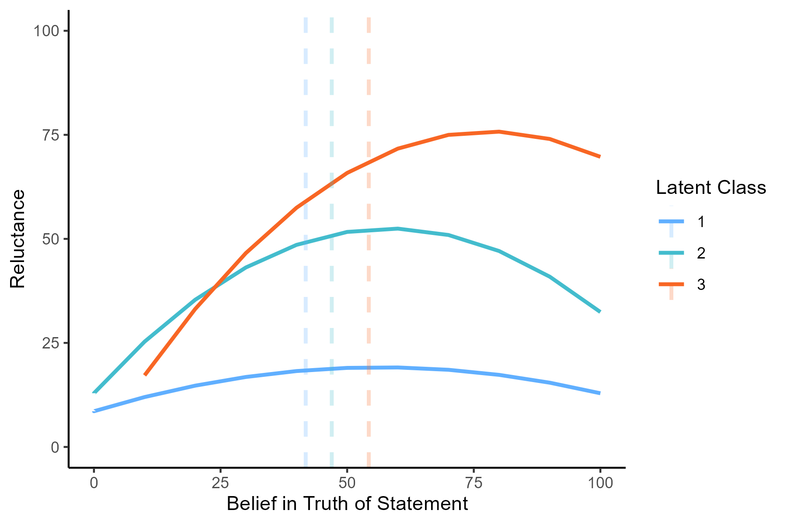
```


``` r
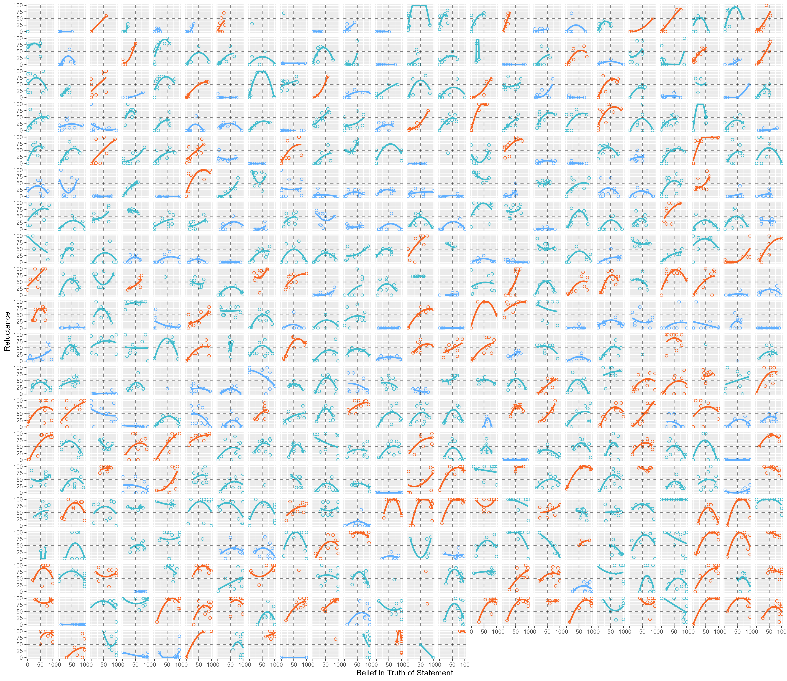
```


``` r
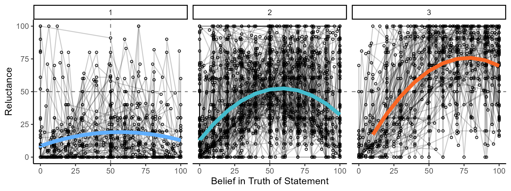
```


``` r
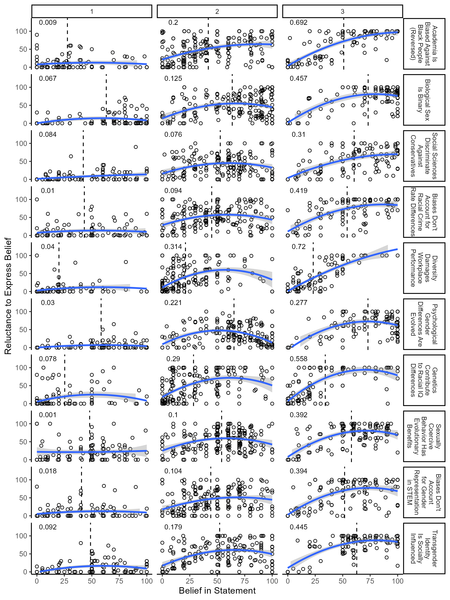
```


### Linear

I also fit a series of models assuming linear effects. Even though they
don’t fit the data very well and aren’t very interesting, here they are.

``` r
summary(lcmm_sc_01)
```

    Heterogenous linear mixed model 
         fitted by maximum likelihood method 
     
    hlme(fixed = self_censor ~ belief, random = ~statement, subject = "id_1", 
        ng = 1, data = taboo_long_rev)
     
    Statistical Model: 
         Dataset: taboo_long_rev 
         Number of subjects: 468 
         Number of observations: 4433 
         Number of observations deleted: 267 
         Number of latent classes: 1 
         Number of parameters: 58  
     
    Iteration process: 
         Maximum number of iteration reached without convergence 
         Number of iterations:  500 
         Convergence criteria: parameters= 0.0043 
                             : likelihood= 0.004 
                             : second derivatives= 1 
     
    Goodness-of-fit statistics: 
         maximum log-likelihood: -20641.72  
         AIC: 41399.44  
         BIC: 41640.05  
     
     
    Maximum Likelihood Estimates: 
     
    Fixed effects in the longitudinal model:

                    coef Se Wald p-value
    intercept   25.27615                
    belief       0.25899                


    Variance-covariance matrix of the random-effects:
                      intercept statementBinary statementCons statementCrime
    intercept         820.55933                                             
    statementBinary  -242.55811        487.1777                             
    statementCons    -461.59346        404.8433     675.45251               
    statementCrime     -6.78756        129.4029      85.43801       58.50645
    statementDivers  -366.78326        238.4313     403.47235       85.12068
    statementMFEvo   -485.51329        487.7368     677.99384      134.96212
    statementRaceIQ   -96.51056        125.5410      54.04045      106.27554
    statementSCBEvo  -339.59020        269.2697     286.64181       78.12801
    statementSTEM    -148.36946        179.4298     147.77692       66.29627
    statementTransSI -216.00227        455.3474     271.47340      128.63026
                     statementDivers statementMFEvo statementRaceIQ statementSCBEvo
    intercept                                                                      
    statementBinary                                                                
    statementCons                                                                  
    statementCrime                                                                 
    statementDivers         508.7302                                               
    statementMFEvo          441.3077       873.5455                                
    statementRaceIQ         209.3103        97.8458        431.2799                
    statementSCBEvo         191.2892       313.8502        145.8727        636.4301
    statementSTEM           152.5183       251.8532        100.0629        167.3763
    statementTransSI        207.3425       370.2454        170.9765        301.0693
                     statementSTEM statementTransSI
    intercept                                      
    statementBinary                                
    statementCons                                  
    statementCrime                                 
    statementDivers                                
    statementMFEvo                                 
    statementRaceIQ                                
    statementSCBEvo                                
    statementSTEM         253.9870                 
    statementTransSI      130.0624         504.5534

                                   coef Se
    Residual standard error:   17.40848   

``` r
summary(lcmm_sc_02)
```

    Heterogenous linear mixed model 
         fitted by maximum likelihood method 
     
    hlme(fixed = self_censor ~ belief, mixture = ~belief, random = ~statement, 
        subject = "id_1", ng = 2, data = taboo_long_rev)
     
    Statistical Model: 
         Dataset: taboo_long_rev 
         Number of subjects: 468 
         Number of observations: 4433 
         Number of observations deleted: 267 
         Number of latent classes: 2 
         Number of parameters: 61  
     
    Iteration process: 
         Maximum number of iteration reached without convergence 
         Number of iterations:  500 
         Convergence criteria: parameters= 7.5e-09 
                             : likelihood= 1.5e-07 
                             : second derivatives= 1 
     
    Goodness-of-fit statistics: 
         maximum log-likelihood: -20573.64  
         AIC: 41269.29  
         BIC: 41522.34  
     
     
    Maximum Likelihood Estimates: 
     
    Fixed effects in the class-membership model:
    (the class of reference is the last class) 

                           coef Se Wald p-value
    intercept class1    0.65892                

    Fixed effects in the longitudinal model:

                           coef Se Wald p-value
    intercept class1   26.56515                
    intercept class2   19.38703                
    belief class1       0.10406                
    belief class2       0.62087                


    Variance-covariance matrix of the random-effects:
                      intercept statementBinary statementCons statementCrime
    intercept         760.07748                                             
    statementBinary  -272.66482        429.8415                             
    statementCons    -474.91503        386.4883     663.20938               
    statementCrime    -36.71396        117.6492      96.88726       70.47255
    statementDivers  -301.11678        243.4412     393.09958       84.40339
    statementMFEvo   -522.48581        441.1909     643.55165      132.02350
    statementRaceIQ   -65.21735        124.1836      52.86267      138.23169
    statementSCBEvo  -320.05977        247.5834     266.63530       72.80933
    statementSTEM    -173.14078        166.4026     153.26242       61.95141
    statementTransSI -218.68722        391.1313     235.59913      106.97645
                     statementDivers statementMFEvo statementRaceIQ statementSCBEvo
    intercept                                                                      
    statementBinary                                                                
    statementCons                                                                  
    statementCrime                                                                 
    statementDivers         420.6204                                               
    statementMFEvo          431.1187      811.95504                                
    statementRaceIQ         159.2636       91.50677        406.9205                
    statementSCBEvo         159.7509      256.50032        122.3527        602.6527
    statementSTEM           146.3242      236.40406        103.4025        171.1908
    statementTransSI        195.4386      318.71140        152.1852        256.7222
                     statementSTEM statementTransSI
    intercept                                      
    statementBinary                                
    statementCons                                  
    statementCrime                                 
    statementDivers                                
    statementMFEvo                                 
    statementRaceIQ                                
    statementSCBEvo                                
    statementSTEM         266.9781                 
    statementTransSI      110.6643         438.5019

                                   coef Se
    Residual standard error:   16.61567   

``` r
summary(lcmm_sc_03)
```

    Heterogenous linear mixed model 
         fitted by maximum likelihood method 
     
    hlme(fixed = self_censor ~ belief, mixture = ~belief, random = ~statement, 
        subject = "id_1", ng = 3, data = taboo_long_rev)
     
    Statistical Model: 
         Dataset: taboo_long_rev 
         Number of subjects: 468 
         Number of observations: 4433 
         Number of observations deleted: 267 
         Number of latent classes: 3 
         Number of parameters: 64  
     
    Iteration process: 
         Maximum number of iteration reached without convergence 
         Number of iterations:  500 
         Convergence criteria: parameters= 1.4e-06 
                             : likelihood= 3e-06 
                             : second derivatives= 1 
     
    Goodness-of-fit statistics: 
         maximum log-likelihood: -20573.65  
         AIC: 41275.3  
         BIC: 41540.81  
     
     
    Maximum Likelihood Estimates: 
     
    Fixed effects in the class-membership model:
    (the class of reference is the last class) 

                           coef Se Wald p-value
    intercept class1   -9.24566                
    intercept class2    0.65956                

    Fixed effects in the longitudinal model:

                           coef Se Wald p-value
    intercept class1    3.04243                
    intercept class2   26.56515                
    intercept class3   19.38488                
    belief class1       0.10000                
    belief class2       0.10413                
    belief class3       0.62098                


    Variance-covariance matrix of the random-effects:
                      intercept statementBinary statementCons statementCrime
    intercept         760.03861                                             
    statementBinary  -272.64223        429.7808                             
    statementCons    -474.91275        386.4776     663.20798               
    statementCrime    -36.66239        117.7510      96.97052       70.41623
    statementDivers  -301.04475        243.4357     393.07294       84.29781
    statementMFEvo   -522.32762        441.0903     643.40734      131.69803
    statementRaceIQ   -65.16924        124.1426      52.84419      138.23157
    statementSCBEvo  -319.65554        247.3185     266.30539       71.82136
    statementSTEM    -173.10168        166.3644     153.23670       61.93426
    statementTransSI -218.58859        391.0823     235.58780      106.84315
                     statementDivers statementMFEvo statementRaceIQ statementSCBEvo
    intercept                                                                      
    statementBinary                                                                
    statementCons                                                                  
    statementCrime                                                                 
    statementDivers         420.4823                                               
    statementMFEvo          430.9421      811.71599                                
    statementRaceIQ         159.2213       91.42654        406.8415                
    statementSCBEvo         159.2518      256.10751        122.1886        601.8769
    statementSTEM           146.2725      236.26640        103.3817        170.8292
    statementTransSI        195.3151      318.50212        152.1340        256.2410
                     statementSTEM statementTransSI
    intercept                                      
    statementBinary                                
    statementCons                                  
    statementCrime                                 
    statementDivers                                
    statementMFEvo                                 
    statementRaceIQ                                
    statementSCBEvo                                
    statementSTEM         266.9062                 
    statementTransSI      110.5852         438.3312

                                   coef Se
    Residual standard error:   16.61681   

``` r
summary(lcmm_sc_04)
```

    Heterogenous linear mixed model 
         fitted by maximum likelihood method 
     
    hlme(fixed = self_censor ~ belief, mixture = ~belief, random = ~statement, 
        subject = "id_1", ng = 4, data = taboo_long_rev)
     
    Statistical Model: 
         Dataset: taboo_long_rev 
         Number of subjects: 468 
         Number of observations: 4433 
         Number of observations deleted: 267 
         Number of latent classes: 4 
         Number of parameters: 67  
     
    Iteration process: 
         Maximum number of iteration reached without convergence 
         Number of iterations:  500 
         Convergence criteria: parameters= 1.4e-06 
                             : likelihood= 1e-07 
                             : second derivatives= 1 
     
    Goodness-of-fit statistics: 
         maximum log-likelihood: -20531.52  
         AIC: 41197.05  
         BIC: 41475  
     
     
    Maximum Likelihood Estimates: 
     
    Fixed effects in the class-membership model:
    (the class of reference is the last class) 

                           coef Se Wald p-value
    intercept class1  -12.57443                
    intercept class2    0.89325                
    intercept class3    0.48409                

    Fixed effects in the longitudinal model:

                           coef Se Wald p-value
    intercept class1   -7.25122                
    intercept class2   11.23378                
    intercept class3   12.68883                
    intercept class4   69.99667                
    belief class1       0.16703                
    belief class2       0.13527                
    belief class3       0.65733                
    belief class4       0.00775                


    Variance-covariance matrix of the random-effects:
                     intercept statementBinary statementCons statementCrime
    intercept         645.2701                                             
    statementBinary  -319.0038        486.6782                             
    statementCons    -506.9773        425.7649      741.3160               
    statementCrime   -112.1168        149.3772      157.3994       182.0638
    statementDivers  -532.8132        295.7813      446.6083       138.5240
    statementMFEvo   -564.6164        478.6716      680.6484       181.7515
    statementRaceIQ  -187.5088        173.7184      105.3252       188.4045
    statementSCBEvo  -317.5144        280.6408      307.3435       119.2253
    statementSTEM    -207.2551        205.1723      197.5802       109.5658
    statementTransSI -275.2799        429.5790      277.7203       164.4054
                     statementDivers statementMFEvo statementRaceIQ statementSCBEvo
    intercept                                                                      
    statementBinary                                                                
    statementCons                                                                  
    statementCrime                                                                 
    statementDivers         467.9907                                               
    statementMFEvo          484.2029       904.4356                                
    statementRaceIQ         194.9186       138.2967        481.1100                
    statementSCBEvo         209.3614       302.2182        164.5190        678.9797
    statementSTEM           192.0356       280.1846        150.5091        209.6406
    statementTransSI        259.1329       365.1013        208.5576        297.3350
                     statementSTEM statementTransSI
    intercept                                      
    statementBinary                                
    statementCons                                  
    statementCrime                                 
    statementDivers                                
    statementMFEvo                                 
    statementRaceIQ                                
    statementSCBEvo                                
    statementSTEM         342.5946                 
    statementTransSI      157.5727         532.2529

                                   coef Se
    Residual standard error:   15.42926   

``` r
summary(lcmm_sc_05)
```

    Heterogenous linear mixed model 
         fitted by maximum likelihood method 
     
    hlme(fixed = self_censor ~ belief, mixture = ~belief, random = ~statement, 
        subject = "id_1", ng = 5, data = taboo_long_rev, convB = 0.01, 
        convL = 0.01, convG = 0.01, maxiter = 5e+06)
     
    Statistical Model: 
         Dataset: taboo_long_rev 
         Number of subjects: 468 
         Number of observations: 4433 
         Number of observations deleted: 267 
         Number of latent classes: 5 
         Number of parameters: 70  
     
    Iteration process: 
         The program stopped abnormally. No results can be displayed.

``` r
summary(lcmm_sc_06)
```

    Heterogenous linear mixed model 
         fitted by maximum likelihood method 
     
    hlme(fixed = self_censor ~ belief, mixture = ~belief, random = ~statement, 
        subject = "id_1", ng = 6, data = taboo_long_rev)
     
    Statistical Model: 
         Dataset: taboo_long_rev 
         Number of subjects: 468 
         Number of observations: 4433 
         Number of observations deleted: 267 
         Number of latent classes: 6 
         Number of parameters: 73  
     
    Iteration process: 
         Convergence criteria satisfied 
         Number of iterations:  337 
         Convergence criteria: parameters= 5.4e-09 
                             : likelihood= 2.4e-08 
                             : second derivatives= 4.2e-07 
     
    Goodness-of-fit statistics: 
         maximum log-likelihood: -20498.4  
         AIC: 41142.81  
         BIC: 41445.65  
     
     
    Maximum Likelihood Estimates: 
     
    Fixed effects in the class-membership model:
    (the class of reference is the last class) 

                           coef         Se     Wald p-value
    intercept class1  -14.94648  178.71073   -0.084 0.93335
    intercept class2   -0.23736    0.29913   -0.794 0.42748
    intercept class3    0.70189    0.20240    3.468 0.00052
    intercept class4    0.51522    0.23937    2.152 0.03136
    intercept class5   -0.21492    0.24002   -0.895 0.37057

    Fixed effects in the longitudinal model:

                           coef         Se     Wald p-value
    intercept class1  -36.83070 2338.92105   -0.016 0.98744
    intercept class2   13.12965    2.72121    4.825 0.00000
    intercept class3    4.30892    1.21695    3.541 0.00040
    intercept class4    8.41355    1.78150    4.723 0.00000
    intercept class5   72.04425    2.51475   28.649 0.00000
    intercept class6   43.60406    3.04100   14.339 0.00000
    belief class1       4.15559  282.33061    0.015 0.98826
    belief class2       0.82610    0.04836   17.083 0.00000
    belief class3       0.09733    0.02066    4.712 0.00000
    belief class4       0.47214    0.04429   10.661 0.00000
    belief class5       0.10404    0.04412    2.358 0.01835
    belief class6       0.06441    0.04503    1.431 0.15257


    Variance-covariance matrix of the random-effects:
                     intercept statementBinary statementCons statementCrime
    intercept         603.4268                                             
    statementBinary  -421.4639        669.2070                             
    statementCons    -577.1039        510.8288      907.7748               
    statementCrime   -181.6575        236.2505      236.7355       355.1443
    statementDivers  -569.4311        364.6346      506.2639       216.6406
    statementMFEvo   -683.8575        563.3204      768.0051       262.5132
    statementRaceIQ  -225.0909        243.7003      163.7224       264.5219
    statementSCBEvo  -356.9674        374.7375      389.9538       213.3968
    statementSTEM    -321.8872        279.5304      274.6813       188.9547
    statementTransSI -336.3266        519.4810      359.3891       249.2030
                     statementDivers statementMFEvo statementRaceIQ statementSCBEvo
    intercept                                                                      
    statementBinary                                                                
    statementCons                                                                  
    statementCrime                                                                 
    statementDivers         604.1366                                               
    statementMFEvo          555.9060      1067.5732                                
    statementRaceIQ         257.6638       202.4354        635.6063                
    statementSCBEvo         302.2018       387.8679        252.5551        867.3629
    statementSTEM           269.4084       351.4679        232.3299        296.5375
    statementTransSI        337.9462       443.4953        287.9883        396.4007
                     statementSTEM statementTransSI
    intercept                                      
    statementBinary                                
    statementCons                                  
    statementCrime                                 
    statementDivers                                
    statementMFEvo                                 
    statementRaceIQ                                
    statementSCBEvo                                
    statementSTEM         509.1871                 
    statementTransSI      238.5478         706.0517

                                   coef         Se
    Residual standard error:   12.22905    2.03979

``` r
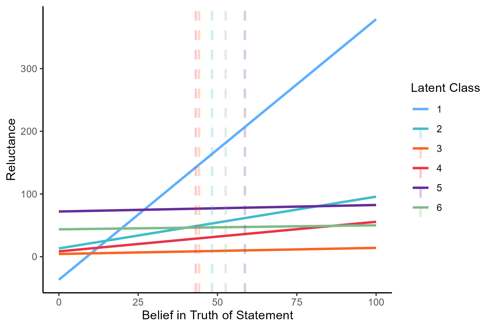
```


``` r
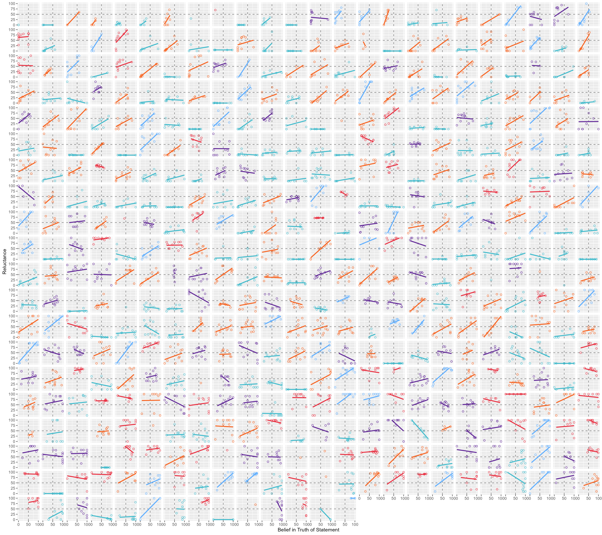
```


# Perceived Risk of Consequences of Expressing Beliefs, by Class

## Raw Data

``` r
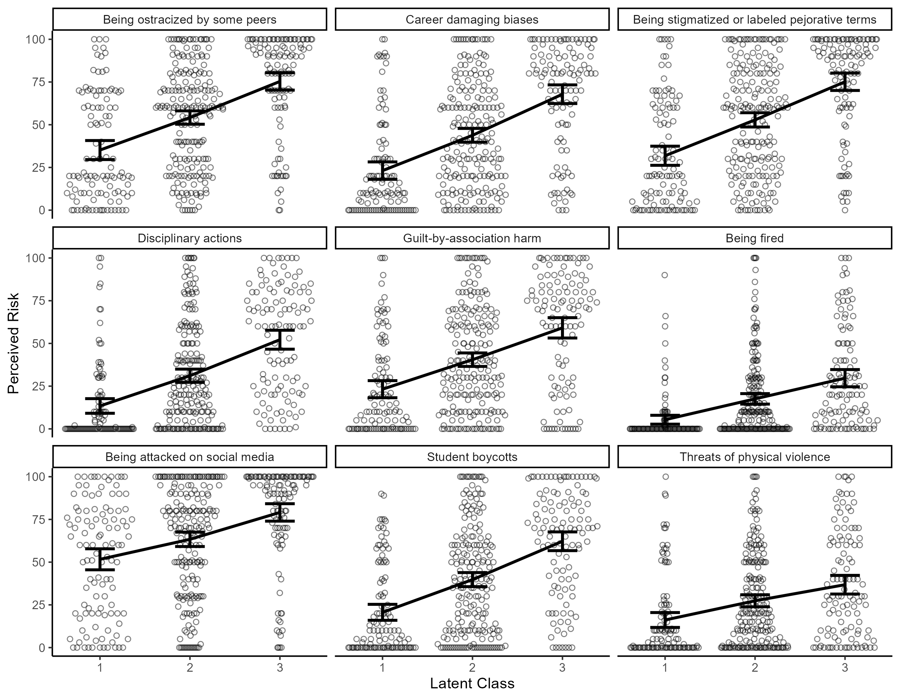
```


## Residuals Approach

``` r
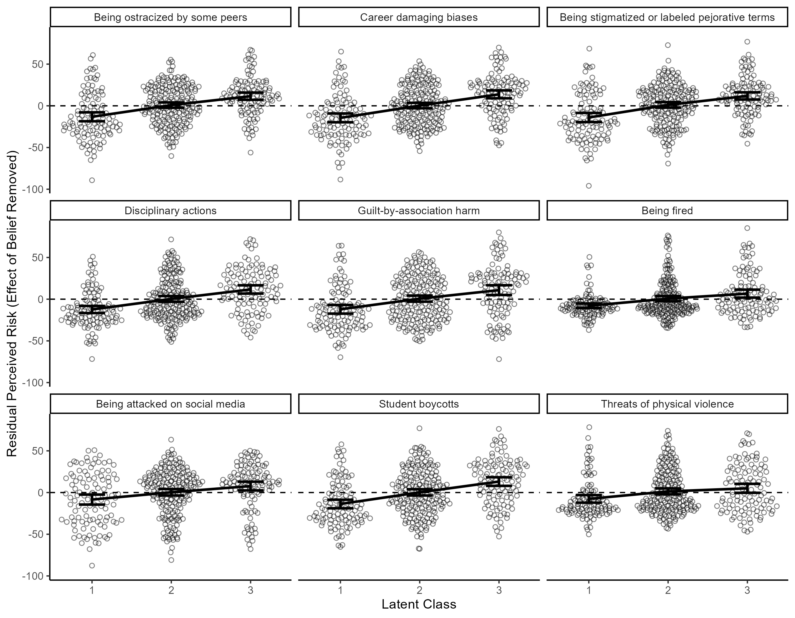
```


### Regression Models for Each Risk (Polynomial Regressors)

``` r
summary(lm_risk_01)
```


    Call:
    lm(formula = OpenRisks__1 ~ 1 + poly(SCBEvo_FT__1, 2) + poly(STEM_FT__1, 
        2) + poly(AcBlack_FT__1, 2) + poly(Binary_FT__1, 2) + poly(Cons_FT__1, 
        2) + poly(Crime_FT__1, 2) + poly(MFEvo_FT__1, 2) + poly(RaceIQ_FT__1, 
        2) + poly(TransSI_FT__1, 2) + poly(Divers_FT__1, 2), data = taboo_class_subset)

    Residuals:
        Min      1Q  Median      3Q     Max 
    -89.259 -19.995   1.135  18.953  67.240 

    Coefficients:
                            Estimate Std. Error t value Pr(>|t|)    
    (Intercept)               54.954      1.314  41.820  < 2e-16 ***
    poly(SCBEvo_FT__1, 2)1    64.849     33.150   1.956 0.051140 .  
    poly(SCBEvo_FT__1, 2)2    20.604     29.441   0.700 0.484425    
    poly(STEM_FT__1, 2)1      78.003     34.777   2.243 0.025454 *  
    poly(STEM_FT__1, 2)2       4.857     32.971   0.147 0.882950    
    poly(AcBlack_FT__1, 2)1  -41.712     33.600  -1.241 0.215181    
    poly(AcBlack_FT__1, 2)2  -23.580     31.138  -0.757 0.449335    
    poly(Binary_FT__1, 2)1    17.456     34.390   0.508 0.612033    
    poly(Binary_FT__1, 2)2    67.498     31.458   2.146 0.032508 *  
    poly(Cons_FT__1, 2)1     191.757     30.608   6.265 9.74e-10 ***
    poly(Cons_FT__1, 2)2      12.544     29.367   0.427 0.669496    
    poly(Crime_FT__1, 2)1    114.111     34.101   3.346 0.000897 ***
    poly(Crime_FT__1, 2)2      5.327     33.489   0.159 0.873686    
    poly(MFEvo_FT__1, 2)1     34.077     36.940   0.923 0.356826    
    poly(MFEvo_FT__1, 2)2     45.892     30.657   1.497 0.135207    
    poly(RaceIQ_FT__1, 2)1   -56.953     33.714  -1.689 0.091952 .  
    poly(RaceIQ_FT__1, 2)2   -29.743     31.049  -0.958 0.338677    
    poly(TransSI_FT__1, 2)1   82.162     32.866   2.500 0.012826 *  
    poly(TransSI_FT__1, 2)2   -5.171     30.148  -0.172 0.863906    
    poly(Divers_FT__1, 2)1    15.744     32.193   0.489 0.625077    
    poly(Divers_FT__1, 2)2   -13.597     30.477  -0.446 0.655734    
    ---
    Signif. codes:  0 '***' 0.001 '**' 0.01 '*' 0.05 '.' 0.1 ' ' 1

    Residual standard error: 26.83 on 396 degrees of freedom
    Multiple R-squared:   0.38, Adjusted R-squared:  0.3487 
    F-statistic: 12.14 on 20 and 396 DF,  p-value: < 2.2e-16

``` r
summary(lm_risk_02)
```


    Call:
    lm(formula = OpenRisks__2 ~ 1 + poly(SCBEvo_FT__1, 2) + poly(STEM_FT__1, 
        2) + poly(AcBlack_FT__1, 2) + poly(Binary_FT__1, 2) + poly(Cons_FT__1, 
        2) + poly(Crime_FT__1, 2) + poly(MFEvo_FT__1, 2) + poly(RaceIQ_FT__1, 
        2) + poly(TransSI_FT__1, 2) + poly(Divers_FT__1, 2), data = taboo_class_subset)

    Residuals:
        Min      1Q  Median      3Q     Max 
    -88.385 -20.331  -0.374  22.448  69.846 

    Coefficients:
                            Estimate Std. Error t value Pr(>|t|)    
    (Intercept)               44.861      1.363  32.911  < 2e-16 ***
    poly(SCBEvo_FT__1, 2)1    18.956     34.387   0.551  0.58177    
    poly(SCBEvo_FT__1, 2)2    17.329     30.539   0.567  0.57074    
    poly(STEM_FT__1, 2)1      61.209     36.075   1.697  0.09053 .  
    poly(STEM_FT__1, 2)2      32.219     34.201   0.942  0.34674    
    poly(AcBlack_FT__1, 2)1  -91.655     34.853  -2.630  0.00888 ** 
    poly(AcBlack_FT__1, 2)2  -21.401     32.299  -0.663  0.50797    
    poly(Binary_FT__1, 2)1    12.881     35.673   0.361  0.71823    
    poly(Binary_FT__1, 2)2    75.724     32.632   2.321  0.02082 *  
    poly(Cons_FT__1, 2)1     235.164     31.750   7.407 7.87e-13 ***
    poly(Cons_FT__1, 2)2      20.055     30.463   0.658  0.51071    
    poly(Crime_FT__1, 2)1     58.647     35.373   1.658  0.09812 .  
    poly(Crime_FT__1, 2)2     -8.217     34.739  -0.237  0.81314    
    poly(MFEvo_FT__1, 2)1     29.721     38.318   0.776  0.43842    
    poly(MFEvo_FT__1, 2)2     42.130     31.801   1.325  0.18600    
    poly(RaceIQ_FT__1, 2)1   -45.598     34.972  -1.304  0.19304    
    poly(RaceIQ_FT__1, 2)2   -25.616     32.207  -0.795  0.42689    
    poly(TransSI_FT__1, 2)1   87.614     34.092   2.570  0.01054 *  
    poly(TransSI_FT__1, 2)2  -33.568     31.273  -1.073  0.28375    
    poly(Divers_FT__1, 2)1    29.845     33.394   0.894  0.37202    
    poly(Divers_FT__1, 2)2     7.963     31.614   0.252  0.80126    
    ---
    Signif. codes:  0 '***' 0.001 '**' 0.01 '*' 0.05 '.' 0.1 ' ' 1

    Residual standard error: 27.83 on 396 degrees of freedom
    Multiple R-squared:  0.3745,    Adjusted R-squared:  0.3429 
    F-statistic: 11.85 on 20 and 396 DF,  p-value: < 2.2e-16

``` r
summary(lm_risk_03)
```


    Call:
    lm(formula = OpenRisks__3 ~ 1 + poly(SCBEvo_FT__1, 2) + poly(STEM_FT__1, 
        2) + poly(AcBlack_FT__1, 2) + poly(Binary_FT__1, 2) + poly(Cons_FT__1, 
        2) + poly(Crime_FT__1, 2) + poly(MFEvo_FT__1, 2) + poly(RaceIQ_FT__1, 
        2) + poly(TransSI_FT__1, 2) + poly(Divers_FT__1, 2), data = taboo_class_subset)

    Residuals:
        Min      1Q  Median      3Q     Max 
    -95.924 -20.017   1.811  18.640  76.859 

    Coefficients:
                            Estimate Std. Error t value Pr(>|t|)    
    (Intercept)              53.3429     1.3491  39.538  < 2e-16 ***
    poly(SCBEvo_FT__1, 2)1   70.5207    34.0353   2.072  0.03891 *  
    poly(SCBEvo_FT__1, 2)2   21.9593    30.2269   0.726  0.46797    
    poly(STEM_FT__1, 2)1     46.6693    35.7056   1.307  0.19195    
    poly(STEM_FT__1, 2)2     42.7534    33.8510   1.263  0.20734    
    poly(AcBlack_FT__1, 2)1 -76.9851    34.4967  -2.232  0.02620 *  
    poly(AcBlack_FT__1, 2)2 -24.9038    31.9689  -0.779  0.43645    
    poly(Binary_FT__1, 2)1   14.2446    35.3085   0.403  0.68685    
    poly(Binary_FT__1, 2)2   38.6463    32.2982   1.197  0.23220    
    poly(Cons_FT__1, 2)1    199.6420    31.4254   6.353 5.81e-10 ***
    poly(Cons_FT__1, 2)2     32.1161    30.1513   1.065  0.28745    
    poly(Crime_FT__1, 2)1   114.0997    35.0115   3.259  0.00121 ** 
    poly(Crime_FT__1, 2)2     4.6499    34.3832   0.135  0.89249    
    poly(MFEvo_FT__1, 2)1    39.0500    37.9258   1.030  0.30381    
    poly(MFEvo_FT__1, 2)2    26.9089    31.4757   0.855  0.39312    
    poly(RaceIQ_FT__1, 2)1  -67.6271    34.6145  -1.954  0.05144 .  
    poly(RaceIQ_FT__1, 2)2    0.3561    31.8779   0.011  0.99109    
    poly(TransSI_FT__1, 2)1 107.0967    33.7437   3.174  0.00162 ** 
    poly(TransSI_FT__1, 2)2 -39.1927    30.9530  -1.266  0.20619    
    poly(Divers_FT__1, 2)1   38.6882    33.0528   1.170  0.24251    
    poly(Divers_FT__1, 2)2  -43.8935    31.2908  -1.403  0.16147    
    ---
    Signif. codes:  0 '***' 0.001 '**' 0.01 '*' 0.05 '.' 0.1 ' ' 1

    Residual standard error: 27.55 on 396 degrees of freedom
    Multiple R-squared:  0.3972,    Adjusted R-squared:  0.3668 
    F-statistic: 13.05 on 20 and 396 DF,  p-value: < 2.2e-16

``` r
summary(lm_risk_04)
```


    Call:
    lm(formula = OpenRisks__4 ~ 1 + poly(SCBEvo_FT__1, 2) + poly(STEM_FT__1, 
        2) + poly(AcBlack_FT__1, 2) + poly(Binary_FT__1, 2) + poly(Cons_FT__1, 
        2) + poly(Crime_FT__1, 2) + poly(MFEvo_FT__1, 2) + poly(RaceIQ_FT__1, 
        2) + poly(TransSI_FT__1, 2) + poly(Divers_FT__1, 2), data = taboo_class_subset)

    Residuals:
        Min      1Q  Median      3Q     Max 
    -71.746 -19.030  -4.302  17.870  72.034 

    Coefficients:
                            Estimate Std. Error t value Pr(>|t|)    
    (Intercept)              32.0240     1.3164  24.328  < 2e-16 ***
    poly(SCBEvo_FT__1, 2)1   52.3765    33.2085   1.577   0.1155    
    poly(SCBEvo_FT__1, 2)2   44.0288    29.4926   1.493   0.1363    
    poly(STEM_FT__1, 2)1     53.6486    34.8382   1.540   0.1244    
    poly(STEM_FT__1, 2)2     -5.8102    33.0287  -0.176   0.8605    
    poly(AcBlack_FT__1, 2)1 -83.6941    33.6587  -2.487   0.0133 *  
    poly(AcBlack_FT__1, 2)2  -2.1413    31.1923  -0.069   0.9453    
    poly(Binary_FT__1, 2)1   -0.5564    34.4507  -0.016   0.9871    
    poly(Binary_FT__1, 2)2   71.0443    31.5136   2.254   0.0247 *  
    poly(Cons_FT__1, 2)1    196.3668    30.6619   6.404 4.29e-10 ***
    poly(Cons_FT__1, 2)2     59.7818    29.4188   2.032   0.0428 *  
    poly(Crime_FT__1, 2)1    18.8216    34.1609   0.551   0.5820    
    poly(Crime_FT__1, 2)2    24.6432    33.5480   0.735   0.4630    
    poly(MFEvo_FT__1, 2)1    40.8519    37.0045   1.104   0.2703    
    poly(MFEvo_FT__1, 2)2    50.3485    30.7110   1.639   0.1019    
    poly(RaceIQ_FT__1, 2)1  -21.2959    33.7736  -0.631   0.5287    
    poly(RaceIQ_FT__1, 2)2  -44.0623    31.1035  -1.417   0.1574    
    poly(TransSI_FT__1, 2)1  59.0055    32.9239   1.792   0.0739 .  
    poly(TransSI_FT__1, 2)2 -59.8827    30.2010  -1.983   0.0481 *  
    poly(Divers_FT__1, 2)1   -1.3370    32.2499  -0.041   0.9670    
    poly(Divers_FT__1, 2)2    9.3836    30.5306   0.307   0.7587    
    ---
    Signif. codes:  0 '***' 0.001 '**' 0.01 '*' 0.05 '.' 0.1 ' ' 1

    Residual standard error: 26.88 on 396 degrees of freedom
    Multiple R-squared:  0.3282,    Adjusted R-squared:  0.2943 
    F-statistic: 9.673 on 20 and 396 DF,  p-value: < 2.2e-16

``` r
summary(lm_risk_05)
```


    Call:
    lm(formula = OpenRisks__5 ~ 1 + poly(SCBEvo_FT__1, 2) + poly(STEM_FT__1, 
        2) + poly(AcBlack_FT__1, 2) + poly(Binary_FT__1, 2) + poly(Cons_FT__1, 
        2) + poly(Crime_FT__1, 2) + poly(MFEvo_FT__1, 2) + poly(RaceIQ_FT__1, 
        2) + poly(TransSI_FT__1, 2) + poly(Divers_FT__1, 2), data = taboo_class_subset)

    Residuals:
        Min      1Q  Median      3Q     Max 
    -71.880 -23.518  -3.952  22.792  80.093 

    Coefficients:
                            Estimate Std. Error t value Pr(>|t|)    
    (Intercept)               40.962      1.466  27.940  < 2e-16 ***
    poly(SCBEvo_FT__1, 2)1   -16.125     36.984  -0.436  0.66308    
    poly(SCBEvo_FT__1, 2)2    28.930     32.846   0.881  0.37897    
    poly(STEM_FT__1, 2)1      71.046     38.799   1.831  0.06783 .  
    poly(STEM_FT__1, 2)2       1.918     36.784   0.052  0.95845    
    poly(AcBlack_FT__1, 2)1 -109.101     37.486  -2.910  0.00381 ** 
    poly(AcBlack_FT__1, 2)2   -7.588     34.739  -0.218  0.82720    
    poly(Binary_FT__1, 2)1     1.147     38.368   0.030  0.97617    
    poly(Binary_FT__1, 2)2    24.532     35.097   0.699  0.48498    
    poly(Cons_FT__1, 2)1     152.805     34.148   4.475    1e-05 ***
    poly(Cons_FT__1, 2)2      58.526     32.764   1.786  0.07481 .  
    poly(Crime_FT__1, 2)1     -8.223     38.045  -0.216  0.82899    
    poly(Crime_FT__1, 2)2    -52.988     37.362  -1.418  0.15692    
    poly(MFEvo_FT__1, 2)1     30.842     41.212   0.748  0.45468    
    poly(MFEvo_FT__1, 2)2      1.135     34.203   0.033  0.97354    
    poly(RaceIQ_FT__1, 2)1   -28.033     37.614  -0.745  0.45654    
    poly(RaceIQ_FT__1, 2)2    10.753     34.640   0.310  0.75640    
    poly(TransSI_FT__1, 2)1   73.681     36.667   2.009  0.04517 *  
    poly(TransSI_FT__1, 2)2    3.914     33.635   0.116  0.90742    
    poly(Divers_FT__1, 2)1    55.119     35.917   1.535  0.12567    
    poly(Divers_FT__1, 2)2   -23.241     34.002  -0.684  0.49467    
    ---
    Signif. codes:  0 '***' 0.001 '**' 0.01 '*' 0.05 '.' 0.1 ' ' 1

    Residual standard error: 29.94 on 396 degrees of freedom
    Multiple R-squared:  0.2305,    Adjusted R-squared:  0.1917 
    F-statistic: 5.932 on 20 and 396 DF,  p-value: 1.015e-13

``` r
summary(lm_risk_06)
```


    Call:
    lm(formula = OpenRisks__6 ~ 1 + poly(SCBEvo_FT__1, 2) + poly(STEM_FT__1, 
        2) + poly(AcBlack_FT__1, 2) + poly(Binary_FT__1, 2) + poly(Cons_FT__1, 
        2) + poly(Crime_FT__1, 2) + poly(MFEvo_FT__1, 2) + poly(RaceIQ_FT__1, 
        2) + poly(TransSI_FT__1, 2) + poly(Divers_FT__1, 2), data = taboo_class_subset)

    Residuals:
        Min      1Q  Median      3Q     Max 
    -36.952 -14.198  -6.641   7.530  85.228 

    Coefficients:
                            Estimate Std. Error t value Pr(>|t|)    
    (Intercept)              17.4173     1.1167  15.597  < 2e-16 ***
    poly(SCBEvo_FT__1, 2)1   30.2289    28.1715   1.073 0.283911    
    poly(SCBEvo_FT__1, 2)2   -6.8600    25.0192  -0.274 0.784082    
    poly(STEM_FT__1, 2)1     26.7767    29.5540   0.906 0.365473    
    poly(STEM_FT__1, 2)2      0.9184    28.0190   0.033 0.973870    
    poly(AcBlack_FT__1, 2)1 -73.2581    28.5534  -2.566 0.010665 *  
    poly(AcBlack_FT__1, 2)2  20.7770    26.4611   0.785 0.432812    
    poly(Binary_FT__1, 2)1  -19.0947    29.2253  -0.653 0.513903    
    poly(Binary_FT__1, 2)2   27.4643    26.7337   1.027 0.304892    
    poly(Cons_FT__1, 2)1     98.9511    26.0112   3.804 0.000165 ***
    poly(Cons_FT__1, 2)2     12.6353    24.9566   0.506 0.612934    
    poly(Crime_FT__1, 2)1    24.3183    28.9795   0.839 0.401888    
    poly(Crime_FT__1, 2)2     8.3525    28.4595   0.293 0.769303    
    poly(MFEvo_FT__1, 2)1    12.7986    31.3917   0.408 0.683710    
    poly(MFEvo_FT__1, 2)2    19.8329    26.0528   0.761 0.446958    
    poly(RaceIQ_FT__1, 2)1   -0.9481    28.6509  -0.033 0.973619    
    poly(RaceIQ_FT__1, 2)2  -20.2994    26.3858  -0.769 0.442155    
    poly(TransSI_FT__1, 2)1  40.3963    27.9301   1.446 0.148874    
    poly(TransSI_FT__1, 2)2 -30.7212    25.6202  -1.199 0.231206    
    poly(Divers_FT__1, 2)1    2.1003    27.3583   0.077 0.938845    
    poly(Divers_FT__1, 2)2  -31.6091    25.8998  -1.220 0.223025    
    ---
    Signif. codes:  0 '***' 0.001 '**' 0.01 '*' 0.05 '.' 0.1 ' ' 1

    Residual standard error: 22.8 on 396 degrees of freedom
    Multiple R-squared:  0.1824,    Adjusted R-squared:  0.1411 
    F-statistic: 4.418 on 20 and 396 DF,  p-value: 2.159e-09

``` r
summary(lm_risk_07)
```


    Call:
    lm(formula = OpenRisks__7 ~ 1 + poly(SCBEvo_FT__1, 2) + poly(STEM_FT__1, 
        2) + poly(AcBlack_FT__1, 2) + poly(Binary_FT__1, 2) + poly(Cons_FT__1, 
        2) + poly(Crime_FT__1, 2) + poly(MFEvo_FT__1, 2) + poly(RaceIQ_FT__1, 
        2) + poly(TransSI_FT__1, 2) + poly(Divers_FT__1, 2), data = taboo_class_subset)

    Residuals:
        Min      1Q  Median      3Q     Max 
    -87.613 -21.530   6.589  20.900  63.428 

    Coefficients:
                            Estimate Std. Error t value Pr(>|t|)    
    (Intercept)               64.825      1.480  43.788  < 2e-16 ***
    poly(SCBEvo_FT__1, 2)1    25.385     37.348   0.680 0.497095    
    poly(SCBEvo_FT__1, 2)2    63.016     33.169   1.900 0.058176 .  
    poly(STEM_FT__1, 2)1      80.260     39.180   2.048 0.041173 *  
    poly(STEM_FT__1, 2)2      42.056     37.145   1.132 0.258231    
    poly(AcBlack_FT__1, 2)1  -50.429     37.854  -1.332 0.183563    
    poly(AcBlack_FT__1, 2)2  -18.694     35.080  -0.533 0.594399    
    poly(Binary_FT__1, 2)1    24.797     38.745   0.640 0.522534    
    poly(Binary_FT__1, 2)2    57.485     35.441   1.622 0.105608    
    poly(Cons_FT__1, 2)1     129.742     34.484   3.762 0.000194 ***
    poly(Cons_FT__1, 2)2      32.129     33.086   0.971 0.332096    
    poly(Crime_FT__1, 2)1      2.415     38.419   0.063 0.949919    
    poly(Crime_FT__1, 2)2     67.637     37.729   1.793 0.073787 .  
    poly(MFEvo_FT__1, 2)1     13.103     41.617   0.315 0.753051    
    poly(MFEvo_FT__1, 2)2    -37.557     34.539  -1.087 0.277529    
    poly(RaceIQ_FT__1, 2)1    -7.403     37.983  -0.195 0.845559    
    poly(RaceIQ_FT__1, 2)2   -57.989     34.980  -1.658 0.098157 .  
    poly(TransSI_FT__1, 2)1   80.151     37.028   2.165 0.031012 *  
    poly(TransSI_FT__1, 2)2  -28.547     33.965  -0.840 0.401142    
    poly(Divers_FT__1, 2)1    -8.100     36.269  -0.223 0.823395    
    poly(Divers_FT__1, 2)2   -17.700     34.336  -0.515 0.606493    
    ---
    Signif. codes:  0 '***' 0.001 '**' 0.01 '*' 0.05 '.' 0.1 ' ' 1

    Residual standard error: 30.23 on 396 degrees of freedom
    Multiple R-squared:  0.2179,    Adjusted R-squared:  0.1784 
    F-statistic: 5.518 on 20 and 396 DF,  p-value: 1.547e-12

``` r
summary(lm_risk_08)
```


    Call:
    lm(formula = OpenRisks__8 ~ 1 + poly(SCBEvo_FT__1, 2) + poly(STEM_FT__1, 
        2) + poly(AcBlack_FT__1, 2) + poly(Binary_FT__1, 2) + poly(Cons_FT__1, 
        2) + poly(Crime_FT__1, 2) + poly(MFEvo_FT__1, 2) + poly(RaceIQ_FT__1, 
        2) + poly(TransSI_FT__1, 2) + poly(Divers_FT__1, 2), data = taboo_class_subset)

    Residuals:
        Min      1Q  Median      3Q     Max 
    -67.537 -22.265  -1.237  21.568  77.038 

    Coefficients:
                            Estimate Std. Error t value Pr(>|t|)    
    (Intercept)               40.849      1.452  28.141  < 2e-16 ***
    poly(SCBEvo_FT__1, 2)1    14.365     36.620   0.392 0.695060    
    poly(SCBEvo_FT__1, 2)2    23.370     32.522   0.719 0.472827    
    poly(STEM_FT__1, 2)1      83.164     38.417   2.165 0.031001 *  
    poly(STEM_FT__1, 2)2      43.224     36.421   1.187 0.236027    
    poly(AcBlack_FT__1, 2)1 -124.716     37.116  -3.360 0.000855 ***
    poly(AcBlack_FT__1, 2)2   10.098     34.396   0.294 0.769234    
    poly(Binary_FT__1, 2)1    17.006     37.989   0.448 0.654659    
    poly(Binary_FT__1, 2)2    37.164     34.751   1.069 0.285518    
    poly(Cons_FT__1, 2)1     162.631     33.812   4.810 2.15e-06 ***
    poly(Cons_FT__1, 2)2       1.841     32.441   0.057 0.954765    
    poly(Crime_FT__1, 2)1      3.901     37.670   0.104 0.917583    
    poly(Crime_FT__1, 2)2    -34.030     36.994  -0.920 0.358195    
    poly(MFEvo_FT__1, 2)1    -21.246     40.806  -0.521 0.602896    
    poly(MFEvo_FT__1, 2)2     15.700     33.866   0.464 0.643184    
    poly(RaceIQ_FT__1, 2)1    10.260     37.243   0.275 0.783092    
    poly(RaceIQ_FT__1, 2)2   -23.972     34.298  -0.699 0.485014    
    poly(TransSI_FT__1, 2)1   91.696     36.306   2.526 0.011938 *  
    poly(TransSI_FT__1, 2)2  -36.028     33.303  -1.082 0.279992    
    poly(Divers_FT__1, 2)1    -6.284     35.563  -0.177 0.859828    
    poly(Divers_FT__1, 2)2   -22.243     33.667  -0.661 0.509207    
    ---
    Signif. codes:  0 '***' 0.001 '**' 0.01 '*' 0.05 '.' 0.1 ' ' 1

    Residual standard error: 29.64 on 396 degrees of freedom
    Multiple R-squared:  0.2623,    Adjusted R-squared:  0.2251 
    F-statistic: 7.042 on 20 and 396 DF,  p-value: < 2.2e-16

``` r
summary(lm_risk_09)
```


    Call:
    lm(formula = OpenRisks__9 ~ 1 + poly(SCBEvo_FT__1, 2) + poly(STEM_FT__1, 
        2) + poly(AcBlack_FT__1, 2) + poly(Binary_FT__1, 2) + poly(Cons_FT__1, 
        2) + poly(Crime_FT__1, 2) + poly(MFEvo_FT__1, 2) + poly(RaceIQ_FT__1, 
        2) + poly(TransSI_FT__1, 2) + poly(Divers_FT__1, 2), data = taboo_class_subset)

    Residuals:
       Min     1Q Median     3Q    Max 
    -50.19 -20.26  -7.78  19.46  78.34 

    Coefficients:
                            Estimate Std. Error t value Pr(>|t|)    
    (Intercept)               26.890      1.334  20.158  < 2e-16 ***
    poly(SCBEvo_FT__1, 2)1   -17.026     33.651  -0.506  0.61318    
    poly(SCBEvo_FT__1, 2)2    39.912     29.886   1.335  0.18248    
    poly(STEM_FT__1, 2)1      35.531     35.303   1.006  0.31481    
    poly(STEM_FT__1, 2)2      11.431     33.469   0.342  0.73288    
    poly(AcBlack_FT__1, 2)1  -65.567     34.108  -1.922  0.05528 .  
    poly(AcBlack_FT__1, 2)2   39.067     31.608   1.236  0.21720    
    poly(Binary_FT__1, 2)1    56.724     34.910   1.625  0.10499    
    poly(Binary_FT__1, 2)2    25.497     31.934   0.798  0.42509    
    poly(Cons_FT__1, 2)1      98.091     31.071   3.157  0.00172 ** 
    poly(Cons_FT__1, 2)2     -15.029     29.811  -0.504  0.61445    
    poly(Crime_FT__1, 2)1     48.433     34.617   1.399  0.16256    
    poly(Crime_FT__1, 2)2     -0.308     33.995  -0.009  0.99278    
    poly(MFEvo_FT__1, 2)1    -18.309     37.498  -0.488  0.62563    
    poly(MFEvo_FT__1, 2)2     50.561     31.121   1.625  0.10503    
    poly(RaceIQ_FT__1, 2)1    -5.562     34.224  -0.163  0.87098    
    poly(RaceIQ_FT__1, 2)2   -42.953     31.518  -1.363  0.17372    
    poly(TransSI_FT__1, 2)1    1.819     33.363   0.055  0.95655    
    poly(TransSI_FT__1, 2)2  -47.447     30.604  -1.550  0.12185    
    poly(Divers_FT__1, 2)1   -41.627     32.680  -1.274  0.20349    
    poly(Divers_FT__1, 2)2    17.905     30.938   0.579  0.56308    
    ---
    Signif. codes:  0 '***' 0.001 '**' 0.01 '*' 0.05 '.' 0.1 ' ' 1

    Residual standard error: 27.24 on 396 degrees of freedom
    Multiple R-squared:  0.1267,    Adjusted R-squared:  0.0826 
    F-statistic: 2.873 on 20 and 396 DF,  p-value: 4.322e-05

### Regression Models for Each Risk (Linear Regressors)

``` r
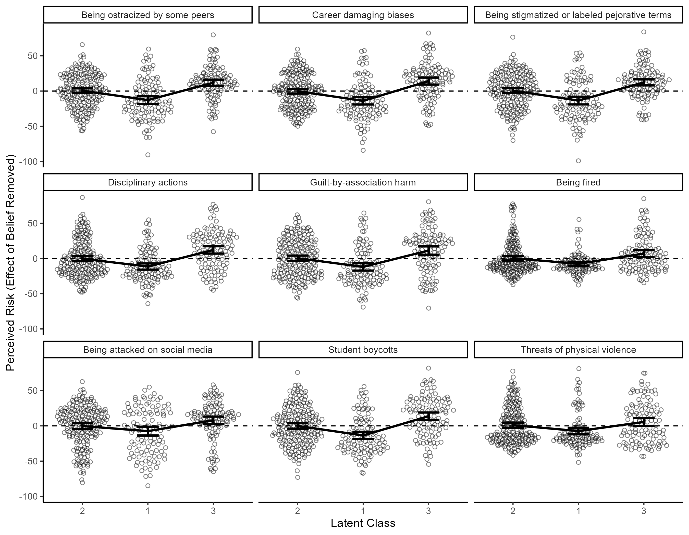
```


``` r
summary(lm_risk_01b)
```


    Call:
    lm(formula = OpenRisks__1 ~ 1 + SCBEvo_FT__1 + STEM_FT__1 + AcBlack_FT__1 + 
        Binary_FT__1 + Cons_FT__1 + Crime_FT__1 + MFEvo_FT__1 + RaceIQ_FT__1 + 
        TransSI_FT__1 + Divers_FT__1, data = taboo_class_subset)

    Residuals:
        Min      1Q  Median      3Q     Max 
    -90.490 -20.217   2.476  19.146  79.690 

    Coefficients:
                   Estimate Std. Error t value Pr(>|t|)    
    (Intercept)    9.843552   6.829993   1.441 0.150292    
    SCBEvo_FT__1   0.117336   0.062632   1.873 0.061728 .  
    STEM_FT__1     0.149117   0.059726   2.497 0.012931 *  
    AcBlack_FT__1 -0.085118   0.051118  -1.665 0.096660 .  
    Binary_FT__1   0.009006   0.051297   0.176 0.860721    
    Cons_FT__1     0.316312   0.050533   6.259 9.83e-10 ***
    Crime_FT__1    0.193161   0.054748   3.528 0.000466 ***
    MFEvo_FT__1    0.053774   0.063490   0.847 0.397509    
    RaceIQ_FT__1  -0.104263   0.057363  -1.818 0.069860 .  
    TransSI_FT__1  0.170977   0.053506   3.195 0.001505 ** 
    Divers_FT__1   0.050167   0.066415   0.755 0.450476    
    ---
    Signif. codes:  0 '***' 0.001 '**' 0.01 '*' 0.05 '.' 0.1 ' ' 1

    Residual standard error: 26.94 on 406 degrees of freedom
    Multiple R-squared:  0.3595,    Adjusted R-squared:  0.3437 
    F-statistic: 22.79 on 10 and 406 DF,  p-value: < 2.2e-16

``` r
summary(lm_risk_02b)
```


    Call:
    lm(formula = OpenRisks__2 ~ 1 + SCBEvo_FT__1 + STEM_FT__1 + AcBlack_FT__1 + 
        Binary_FT__1 + Cons_FT__1 + Crime_FT__1 + MFEvo_FT__1 + RaceIQ_FT__1 + 
        TransSI_FT__1 + Divers_FT__1, data = taboo_class_subset)

    Residuals:
        Min      1Q  Median      3Q     Max 
    -84.086 -22.142   0.066  21.807  82.290 

    Coefficients:
                   Estimate Std. Error t value Pr(>|t|)    
    (Intercept)   10.532483   7.091557   1.485  0.13826    
    SCBEvo_FT__1   0.026293   0.065030   0.404  0.68620    
    STEM_FT__1     0.125228   0.062013   2.019  0.04410 *  
    AcBlack_FT__1 -0.161406   0.053076  -3.041  0.00251 ** 
    Binary_FT__1  -0.004901   0.053261  -0.092  0.92673    
    Cons_FT__1     0.388635   0.052468   7.407 7.54e-13 ***
    Crime_FT__1    0.100282   0.056845   1.764  0.07846 .  
    MFEvo_FT__1    0.042748   0.065921   0.648  0.51705    
    RaceIQ_FT__1  -0.083659   0.059560  -1.405  0.16090    
    TransSI_FT__1  0.181895   0.055555   3.274  0.00115 ** 
    Divers_FT__1   0.084244   0.068959   1.222  0.22255    
    ---
    Signif. codes:  0 '***' 0.001 '**' 0.01 '*' 0.05 '.' 0.1 ' ' 1

    Residual standard error: 27.97 on 406 degrees of freedom
    Multiple R-squared:  0.3525,    Adjusted R-squared:  0.3366 
    F-statistic: 22.11 on 10 and 406 DF,  p-value: < 2.2e-16

``` r
summary(lm_risk_03b)
```


    Call:
    lm(formula = OpenRisks__3 ~ 1 + SCBEvo_FT__1 + STEM_FT__1 + AcBlack_FT__1 + 
        Binary_FT__1 + Cons_FT__1 + Crime_FT__1 + MFEvo_FT__1 + RaceIQ_FT__1 + 
        TransSI_FT__1 + Divers_FT__1, data = taboo_class_subset)

    Residuals:
        Min      1Q  Median      3Q     Max 
    -98.997 -20.952   1.898  19.453  83.894 

    Coefficients:
                  Estimate Std. Error t value Pr(>|t|)    
    (Intercept)    9.84999    7.00010   1.407 0.160156    
    SCBEvo_FT__1   0.11134    0.06419   1.734 0.083599 .  
    STEM_FT__1     0.09499    0.06121   1.552 0.121484    
    AcBlack_FT__1 -0.13497    0.05239  -2.576 0.010341 *  
    Binary_FT__1   0.02187    0.05257   0.416 0.677710    
    Cons_FT__1     0.32922    0.05179   6.357 5.55e-10 ***
    Crime_FT__1    0.18097    0.05611   3.225 0.001361 ** 
    MFEvo_FT__1    0.06108    0.06507   0.939 0.348451    
    RaceIQ_FT__1  -0.10809    0.05879  -1.838 0.066725 .  
    TransSI_FT__1  0.20790    0.05484   3.791 0.000173 ***
    Divers_FT__1   0.08718    0.06807   1.281 0.201002    
    ---
    Signif. codes:  0 '***' 0.001 '**' 0.01 '*' 0.05 '.' 0.1 ' ' 1

    Residual standard error: 27.61 on 406 degrees of freedom
    Multiple R-squared:  0.3794,    Adjusted R-squared:  0.3642 
    F-statistic: 24.83 on 10 and 406 DF,  p-value: < 2.2e-16

``` r
summary(lm_risk_04b)
```


    Call:
    lm(formula = OpenRisks__4 ~ 1 + SCBEvo_FT__1 + STEM_FT__1 + AcBlack_FT__1 + 
        Binary_FT__1 + Cons_FT__1 + Crime_FT__1 + MFEvo_FT__1 + RaceIQ_FT__1 + 
        TransSI_FT__1 + Divers_FT__1, data = taboo_class_subset)

    Residuals:
        Min      1Q  Median      3Q     Max 
    -64.045 -20.571  -5.099  17.978  86.507 

    Coefficients:
                  Estimate Std. Error t value Pr(>|t|)    
    (Intercept)    3.41504    6.94391   0.492  0.62312    
    SCBEvo_FT__1   0.08310    0.06368   1.305  0.19264    
    STEM_FT__1     0.10962    0.06072   1.805  0.07176 .  
    AcBlack_FT__1 -0.15152    0.05197  -2.915  0.00375 ** 
    Binary_FT__1  -0.02420    0.05215  -0.464  0.64290    
    Cons_FT__1     0.31375    0.05138   6.107 2.38e-09 ***
    Crime_FT__1    0.04523    0.05566   0.813  0.41697    
    MFEvo_FT__1    0.05864    0.06455   0.908  0.36416    
    RaceIQ_FT__1  -0.04008    0.05832  -0.687  0.49237    
    TransSI_FT__1  0.14657    0.05440   2.694  0.00735 ** 
    Divers_FT__1   0.02329    0.06752   0.345  0.73032    
    ---
    Signif. codes:  0 '***' 0.001 '**' 0.01 '*' 0.05 '.' 0.1 ' ' 1

    Residual standard error: 27.39 on 406 degrees of freedom
    Multiple R-squared:  0.2852,    Adjusted R-squared:  0.2676 
    F-statistic:  16.2 on 10 and 406 DF,  p-value: < 2.2e-16

``` r
summary(lm_risk_05b)
```


    Call:
    lm(formula = OpenRisks__5 ~ 1 + SCBEvo_FT__1 + STEM_FT__1 + AcBlack_FT__1 + 
        Binary_FT__1 + Cons_FT__1 + Crime_FT__1 + MFEvo_FT__1 + RaceIQ_FT__1 + 
        TransSI_FT__1 + Divers_FT__1, data = taboo_class_subset)

    Residuals:
        Min      1Q  Median      3Q     Max 
    -70.431 -23.393  -2.764  23.282  80.369 

    Coefficients:
                   Estimate Std. Error t value Pr(>|t|)    
    (Intercept)   21.619382   7.565796   2.858  0.00449 ** 
    SCBEvo_FT__1  -0.034602   0.069379  -0.499  0.61823    
    STEM_FT__1     0.132311   0.066160   2.000  0.04618 *  
    AcBlack_FT__1 -0.168363   0.056625  -2.973  0.00312 ** 
    Binary_FT__1   0.009650   0.056823   0.170  0.86523    
    Cons_FT__1     0.247466   0.055977   4.421 1.26e-05 ***
    Crime_FT__1    0.001546   0.060646   0.025  0.97967    
    MFEvo_FT__1    0.044374   0.070329   0.631  0.52843    
    RaceIQ_FT__1  -0.038446   0.063543  -0.605  0.54549    
    TransSI_FT__1  0.136219   0.059271   2.298  0.02205 *  
    Divers_FT__1   0.107312   0.073570   1.459  0.14544    
    ---
    Signif. codes:  0 '***' 0.001 '**' 0.01 '*' 0.05 '.' 0.1 ' ' 1

    Residual standard error: 29.84 on 406 degrees of freedom
    Multiple R-squared:  0.2163,    Adjusted R-squared:  0.197 
    F-statistic: 11.21 on 10 and 406 DF,  p-value: < 2.2e-16

``` r
summary(lm_risk_06b)
```


    Call:
    lm(formula = OpenRisks__6 ~ 1 + SCBEvo_FT__1 + STEM_FT__1 + AcBlack_FT__1 + 
        Binary_FT__1 + Cons_FT__1 + Crime_FT__1 + MFEvo_FT__1 + RaceIQ_FT__1 + 
        TransSI_FT__1 + Divers_FT__1, data = taboo_class_subset)

    Residuals:
        Min      1Q  Median      3Q     Max 
    -37.706 -14.777  -5.794   7.336  84.770 

    Coefficients:
                   Estimate Std. Error t value Pr(>|t|)    
    (Intercept)    6.039473   5.763336   1.048 0.295302    
    SCBEvo_FT__1   0.041730   0.052850   0.790 0.430234    
    STEM_FT__1     0.059948   0.050398   1.189 0.234943    
    AcBlack_FT__1 -0.128539   0.043135  -2.980 0.003057 ** 
    Binary_FT__1  -0.032196   0.043286  -0.744 0.457432    
    Cons_FT__1     0.160761   0.042641   3.770 0.000187 ***
    Crime_FT__1    0.033198   0.046198   0.719 0.472795    
    MFEvo_FT__1    0.023403   0.053574   0.437 0.662466    
    RaceIQ_FT__1  -0.001172   0.048404  -0.024 0.980697    
    TransSI_FT__1  0.082229   0.045150   1.821 0.069307 .  
    Divers_FT__1   0.008713   0.056043   0.155 0.876521    
    ---
    Signif. codes:  0 '***' 0.001 '**' 0.01 '*' 0.05 '.' 0.1 ' ' 1

    Residual standard error: 22.73 on 406 degrees of freedom
    Multiple R-squared:  0.1672,    Adjusted R-squared:  0.1467 
    F-statistic: 8.153 on 10 and 406 DF,  p-value: 4.723e-12

``` r
summary(lm_risk_07b)
```


    Call:
    lm(formula = OpenRisks__7 ~ 1 + SCBEvo_FT__1 + STEM_FT__1 + AcBlack_FT__1 + 
        Binary_FT__1 + Cons_FT__1 + Crime_FT__1 + MFEvo_FT__1 + RaceIQ_FT__1 + 
        TransSI_FT__1 + Divers_FT__1, data = taboo_class_subset)

    Residuals:
        Min      1Q  Median      3Q     Max 
    -84.982 -18.801   5.877  20.973  62.708 

    Coefficients:
                   Estimate Std. Error t value Pr(>|t|)    
    (Intercept)   38.195814   7.750308   4.928 1.21e-06 ***
    SCBEvo_FT__1   0.023707   0.071071   0.334 0.738877    
    STEM_FT__1     0.148334   0.067773   2.189 0.029190 *  
    AcBlack_FT__1 -0.094192   0.058006  -1.624 0.105191    
    Binary_FT__1   0.038004   0.058209   0.653 0.514193    
    Cons_FT__1     0.218865   0.057342   3.817 0.000156 ***
    Crime_FT__1   -0.001266   0.062125  -0.020 0.983747    
    MFEvo_FT__1    0.010059   0.072045   0.140 0.889031    
    RaceIQ_FT__1  -0.023199   0.065092  -0.356 0.721724    
    TransSI_FT__1  0.181250   0.060716   2.985 0.003005 ** 
    Divers_FT__1   0.020437   0.075364   0.271 0.786392    
    ---
    Signif. codes:  0 '***' 0.001 '**' 0.01 '*' 0.05 '.' 0.1 ' ' 1

    Residual standard error: 30.57 on 406 degrees of freedom
    Multiple R-squared:  0.1804,    Adjusted R-squared:  0.1602 
    F-statistic: 8.935 on 10 and 406 DF,  p-value: 2.507e-13

``` r
summary(lm_risk_08b)
```


    Call:
    lm(formula = OpenRisks__8 ~ 1 + SCBEvo_FT__1 + STEM_FT__1 + AcBlack_FT__1 + 
        Binary_FT__1 + Cons_FT__1 + Crime_FT__1 + MFEvo_FT__1 + RaceIQ_FT__1 + 
        TransSI_FT__1 + Divers_FT__1, data = taboo_class_subset)

    Residuals:
        Min      1Q  Median      3Q     Max 
    -73.034 -22.489  -1.757  22.180  81.863 

    Coefficients:
                   Estimate Std. Error t value Pr(>|t|)    
    (Intercept)   22.584984   7.482205   3.018 0.002701 ** 
    SCBEvo_FT__1   0.017966   0.068613   0.262 0.793570    
    STEM_FT__1     0.163904   0.065429   2.505 0.012634 *  
    AcBlack_FT__1 -0.206300   0.056000  -3.684 0.000261 ***
    Binary_FT__1   0.015808   0.056195   0.281 0.778625    
    Cons_FT__1     0.269697   0.055359   4.872 1.59e-06 ***
    Crime_FT__1   -0.001896   0.059976  -0.032 0.974803    
    MFEvo_FT__1   -0.043018   0.069552  -0.618 0.536599    
    RaceIQ_FT__1   0.020337   0.062841   0.324 0.746381    
    TransSI_FT__1  0.170207   0.058616   2.904 0.003888 ** 
    Divers_FT__1  -0.003306   0.072757  -0.045 0.963778    
    ---
    Signif. codes:  0 '***' 0.001 '**' 0.01 '*' 0.05 '.' 0.1 ' ' 1

    Residual standard error: 29.51 on 406 degrees of freedom
    Multiple R-squared:  0.2505,    Adjusted R-squared:  0.2321 
    F-statistic: 13.57 on 10 and 406 DF,  p-value: < 2.2e-16

``` r
summary(lm_risk_09b)
```


    Call:
    lm(formula = OpenRisks__9 ~ 1 + SCBEvo_FT__1 + STEM_FT__1 + AcBlack_FT__1 + 
        Binary_FT__1 + Cons_FT__1 + Crime_FT__1 + MFEvo_FT__1 + RaceIQ_FT__1 + 
        TransSI_FT__1 + Divers_FT__1, data = taboo_class_subset)

    Residuals:
        Min      1Q  Median      3Q     Max 
    -51.726 -20.605  -9.374  17.762  81.159 

    Coefficients:
                  Estimate Std. Error t value Pr(>|t|)   
    (Intercept)   19.75065    6.93109   2.850  0.00460 **
    SCBEvo_FT__1  -0.03403    0.06356  -0.535  0.59265   
    STEM_FT__1     0.07401    0.06061   1.221  0.22278   
    AcBlack_FT__1 -0.11616    0.05188  -2.239  0.02568 * 
    Binary_FT__1   0.05520    0.05206   1.060  0.28963   
    Cons_FT__1     0.16065    0.05128   3.133  0.00186 **
    Crime_FT__1    0.08044    0.05556   1.448  0.14845   
    MFEvo_FT__1   -0.04172    0.06443  -0.648  0.51766   
    RaceIQ_FT__1  -0.01010    0.05821  -0.174  0.86228   
    TransSI_FT__1  0.01798    0.05430   0.331  0.74072   
    Divers_FT__1  -0.06145    0.06740  -0.912  0.36241   
    ---
    Signif. codes:  0 '***' 0.001 '**' 0.01 '*' 0.05 '.' 0.1 ' ' 1

    Residual standard error: 27.33 on 406 degrees of freedom
    Multiple R-squared:  0.09839,   Adjusted R-squared:  0.07618 
    F-statistic:  4.43 on 10 and 406 DF,  p-value: 6.211e-06

## Class-as-Predictor Approach

``` r
summary(lm_risk_01_cl)
```


    Call:
    lm(formula = OpenRisks__1 ~ 1 + poly(SCBEvo_FT__1, 2) + poly(STEM_FT__1, 
        2) + poly(AcBlack_FT__1, 2) + poly(Binary_FT__1, 2) + poly(Cons_FT__1, 
        2) + poly(Crime_FT__1, 2) + poly(MFEvo_FT__1, 2) + poly(RaceIQ_FT__1, 
        2) + poly(TransSI_FT__1, 2) + poly(Divers_FT__1, 2) + class, 
        data = taboo_class_subset)

    Residuals:
        Min      1Q  Median      3Q     Max 
    -71.817 -17.803   0.274  17.413  67.271 

    Coefficients:
                             Estimate Std. Error t value Pr(>|t|)    
    (Intercept)              55.94326    1.80033  31.074  < 2e-16 ***
    poly(SCBEvo_FT__1, 2)1   55.85092   30.93696   1.805 0.071789 .  
    poly(SCBEvo_FT__1, 2)2   12.54124   27.46576   0.457 0.648200    
    poly(STEM_FT__1, 2)1     72.25073   32.43224   2.228 0.026462 *  
    poly(STEM_FT__1, 2)2      0.04285   30.78313   0.001 0.998890    
    poly(AcBlack_FT__1, 2)1   0.73204   31.83931   0.023 0.981669    
    poly(AcBlack_FT__1, 2)2 -31.22361   29.10694  -1.073 0.284053    
    poly(Binary_FT__1, 2)1   25.16791   32.13082   0.783 0.433925    
    poly(Binary_FT__1, 2)2   73.95125   29.42220   2.513 0.012354 *  
    poly(Cons_FT__1, 2)1    154.61408   28.94723   5.341 1.56e-07 ***
    poly(Cons_FT__1, 2)2     26.56935   27.47528   0.967 0.334124    
    poly(Crime_FT__1, 2)1   112.04654   31.81285   3.522 0.000478 ***
    poly(Crime_FT__1, 2)2    22.48345   31.30888   0.718 0.473110    
    poly(MFEvo_FT__1, 2)1    24.61900   34.47146   0.714 0.475536    
    poly(MFEvo_FT__1, 2)2    40.42787   28.58888   1.414 0.158119    
    poly(RaceIQ_FT__1, 2)1  -50.16985   31.44239  -1.596 0.111377    
    poly(RaceIQ_FT__1, 2)2  -34.63790   28.96301  -1.196 0.232441    
    poly(TransSI_FT__1, 2)1  66.53249   30.74161   2.164 0.031045 *  
    poly(TransSI_FT__1, 2)2  -9.50825   28.15261  -0.338 0.735739    
    poly(Divers_FT__1, 2)1   33.56195   30.10949   1.115 0.265674    
    poly(Divers_FT__1, 2)2   -5.66232   28.45879  -0.199 0.842392    
    class1                  -16.10863    3.11580  -5.170 3.73e-07 ***
    class3                   12.21363    3.07703   3.969 8.57e-05 ***
    ---
    Signif. codes:  0 '***' 0.001 '**' 0.01 '*' 0.05 '.' 0.1 ' ' 1

    Residual standard error: 25.02 on 394 degrees of freedom
    Multiple R-squared:  0.4639,    Adjusted R-squared:  0.4339 
    F-statistic:  15.5 on 22 and 394 DF,  p-value: < 2.2e-16

``` r
summary(lm_risk_02_cl)
```


    Call:
    lm(formula = OpenRisks__2 ~ 1 + poly(SCBEvo_FT__1, 2) + poly(STEM_FT__1, 
        2) + poly(AcBlack_FT__1, 2) + poly(Binary_FT__1, 2) + poly(Cons_FT__1, 
        2) + poly(Crime_FT__1, 2) + poly(MFEvo_FT__1, 2) + poly(RaceIQ_FT__1, 
        2) + poly(TransSI_FT__1, 2) + poly(Divers_FT__1, 2) + class, 
        data = taboo_class_subset)

    Residuals:
        Min      1Q  Median      3Q     Max 
    -67.917 -18.995   0.148  15.931  75.212 

    Coefficients:
                            Estimate Std. Error t value Pr(>|t|)    
    (Intercept)               45.298      1.837  24.655  < 2e-16 ***
    poly(SCBEvo_FT__1, 2)1     9.160     31.571   0.290  0.77188    
    poly(SCBEvo_FT__1, 2)2     8.147     28.029   0.291  0.77147    
    poly(STEM_FT__1, 2)1      54.451     33.097   1.645  0.10073    
    poly(STEM_FT__1, 2)2      25.927     31.414   0.825  0.40969    
    poly(AcBlack_FT__1, 2)1  -44.357     32.492  -1.365  0.17298    
    poly(AcBlack_FT__1, 2)2  -31.088     29.704  -1.047  0.29592    
    poly(Binary_FT__1, 2)1    20.665     32.790   0.630  0.52891    
    poly(Binary_FT__1, 2)2    81.903     30.026   2.728  0.00666 ** 
    poly(Cons_FT__1, 2)1     193.538     29.541   6.552 1.78e-10 ***
    poly(Cons_FT__1, 2)2      35.232     28.039   1.257  0.20966    
    poly(Crime_FT__1, 2)1     55.698     32.465   1.716  0.08702 .  
    poly(Crime_FT__1, 2)2     11.742     31.951   0.367  0.71345    
    poly(MFEvo_FT__1, 2)1     18.469     35.178   0.525  0.59986    
    poly(MFEvo_FT__1, 2)2     35.933     29.175   1.232  0.21882    
    poly(RaceIQ_FT__1, 2)1   -37.889     32.087  -1.181  0.23839    
    poly(RaceIQ_FT__1, 2)2   -31.592     29.557  -1.069  0.28579    
    poly(TransSI_FT__1, 2)1   69.053     31.372   2.201  0.02831 *  
    poly(TransSI_FT__1, 2)2  -37.701     28.730  -1.312  0.19020    
    poly(Divers_FT__1, 2)1    50.535     30.727   1.645  0.10084    
    poly(Divers_FT__1, 2)2    17.649     29.042   0.608  0.54375    
    class1                   -17.087      3.180  -5.374 1.32e-07 ***
    class3                    15.275      3.140   4.865 1.66e-06 ***
    ---
    Signif. codes:  0 '***' 0.001 '**' 0.01 '*' 0.05 '.' 0.1 ' ' 1

    Residual standard error: 25.53 on 394 degrees of freedom
    Multiple R-squared:  0.4765,    Adjusted R-squared:  0.4472 
    F-statistic:  16.3 on 22 and 394 DF,  p-value: < 2.2e-16

``` r
summary(lm_risk_03_cl)
```


    Call:
    lm(formula = OpenRisks__3 ~ 1 + poly(SCBEvo_FT__1, 2) + poly(STEM_FT__1, 
        2) + poly(AcBlack_FT__1, 2) + poly(Binary_FT__1, 2) + poly(Cons_FT__1, 
        2) + poly(Crime_FT__1, 2) + poly(MFEvo_FT__1, 2) + poly(RaceIQ_FT__1, 
        2) + poly(TransSI_FT__1, 2) + poly(Divers_FT__1, 2) + class, 
        data = taboo_class_subset)

    Residuals:
        Min      1Q  Median      3Q     Max 
    -76.347 -16.879  -0.416  16.568  79.262 

    Coefficients:
                            Estimate Std. Error t value Pr(>|t|)    
    (Intercept)               54.622      1.841  29.664  < 2e-16 ***
    poly(SCBEvo_FT__1, 2)1    60.911     31.642   1.925 0.054950 .  
    poly(SCBEvo_FT__1, 2)2    13.490     28.092   0.480 0.631353    
    poly(STEM_FT__1, 2)1      40.700     33.172   1.227 0.220570    
    poly(STEM_FT__1, 2)2      37.979     31.485   1.206 0.228442    
    poly(AcBlack_FT__1, 2)1  -32.040     32.565  -0.984 0.325779    
    poly(AcBlack_FT__1, 2)2  -32.590     29.771  -1.095 0.274315    
    poly(Binary_FT__1, 2)1    22.694     32.863   0.691 0.490244    
    poly(Binary_FT__1, 2)2    45.833     30.093   1.523 0.128548    
    poly(Cons_FT__1, 2)1     160.392     29.607   5.417 1.06e-07 ***
    poly(Cons_FT__1, 2)2      47.125     28.102   1.677 0.094345 .  
    poly(Crime_FT__1, 2)1    112.140     32.538   3.446 0.000629 ***
    poly(Crime_FT__1, 2)2     22.523     32.023   0.703 0.482247    
    poly(MFEvo_FT__1, 2)1     29.283     35.257   0.831 0.406725    
    poly(MFEvo_FT__1, 2)2     21.161     29.241   0.724 0.469690    
    poly(RaceIQ_FT__1, 2)1   -60.497     32.159  -1.881 0.060686 .  
    poly(RaceIQ_FT__1, 2)2    -4.645     29.623  -0.157 0.875477    
    poly(TransSI_FT__1, 2)1   90.946     31.442   2.892 0.004035 ** 
    poly(TransSI_FT__1, 2)2  -44.030     28.794  -1.529 0.127034    
    poly(Divers_FT__1, 2)1    57.265     30.796   1.859 0.063702 .  
    poly(Divers_FT__1, 2)2   -35.785     29.108  -1.229 0.219649    
    class1                   -17.360      3.187  -5.447 9.03e-08 ***
    class3                    12.352      3.147   3.925 0.000102 ***
    ---
    Signif. codes:  0 '***' 0.001 '**' 0.01 '*' 0.05 '.' 0.1 ' ' 1

    Residual standard error: 25.59 on 394 degrees of freedom
    Multiple R-squared:  0.4827,    Adjusted R-squared:  0.4538 
    F-statistic: 16.71 on 22 and 394 DF,  p-value: < 2.2e-16

``` r
summary(lm_risk_04_cl)
```


    Call:
    lm(formula = OpenRisks__4 ~ 1 + poly(SCBEvo_FT__1, 2) + poly(STEM_FT__1, 
        2) + poly(AcBlack_FT__1, 2) + poly(Binary_FT__1, 2) + poly(Cons_FT__1, 
        2) + poly(Crime_FT__1, 2) + poly(MFEvo_FT__1, 2) + poly(RaceIQ_FT__1, 
        2) + poly(TransSI_FT__1, 2) + poly(Divers_FT__1, 2) + class, 
        data = taboo_class_subset)

    Residuals:
        Min      1Q  Median      3Q     Max 
    -55.407 -17.443  -3.211  16.937  66.507 

    Coefficients:
                            Estimate Std. Error t value Pr(>|t|)    
    (Intercept)               32.459      1.812  17.916  < 2e-16 ***
    poly(SCBEvo_FT__1, 2)1    43.972     31.132   1.412  0.15861    
    poly(SCBEvo_FT__1, 2)2    36.189     27.639   1.309  0.19118    
    poly(STEM_FT__1, 2)1      47.897     32.637   1.468  0.14301    
    poly(STEM_FT__1, 2)2     -11.110     30.977  -0.359  0.72006    
    poly(AcBlack_FT__1, 2)1  -43.220     32.040  -1.349  0.17813    
    poly(AcBlack_FT__1, 2)2  -10.323     29.291  -0.352  0.72469    
    poly(Binary_FT__1, 2)1     6.179     32.334   0.191  0.84855    
    poly(Binary_FT__1, 2)2    76.424     29.608   2.581  0.01021 *  
    poly(Cons_FT__1, 2)1     160.768     29.130   5.519 6.19e-08 ***
    poly(Cons_FT__1, 2)2      72.811     27.649   2.633  0.00879 ** 
    poly(Crime_FT__1, 2)1     16.357     32.014   0.511  0.60967    
    poly(Crime_FT__1, 2)2     41.645     31.506   1.322  0.18700    
    poly(MFEvo_FT__1, 2)1     31.289     34.689   0.902  0.36761    
    poly(MFEvo_FT__1, 2)2     45.056     28.769   1.566  0.11813    
    poly(RaceIQ_FT__1, 2)1   -14.712     31.641  -0.465  0.64220    
    poly(RaceIQ_FT__1, 2)2   -49.128     29.146  -1.686  0.09266 .  
    poly(TransSI_FT__1, 2)1   43.227     30.936   1.397  0.16310    
    poly(TransSI_FT__1, 2)2  -63.483     28.330  -2.241  0.02559 *  
    poly(Divers_FT__1, 2)1    16.291     30.299   0.538  0.59111    
    poly(Divers_FT__1, 2)2    17.594     28.638   0.614  0.53933    
    class1                   -14.701      3.135  -4.689 3.80e-06 ***
    class3                    12.919      3.096   4.172 3.71e-05 ***
    ---
    Signif. codes:  0 '***' 0.001 '**' 0.01 '*' 0.05 '.' 0.1 ' ' 1

    Residual standard error: 25.17 on 394 degrees of freedom
    Multiple R-squared:  0.4138,    Adjusted R-squared:  0.3811 
    F-statistic: 12.64 on 22 and 394 DF,  p-value: < 2.2e-16

``` r
summary(lm_risk_05_cl)
```


    Call:
    lm(formula = OpenRisks__5 ~ 1 + poly(SCBEvo_FT__1, 2) + poly(STEM_FT__1, 
        2) + poly(AcBlack_FT__1, 2) + poly(Binary_FT__1, 2) + poly(Cons_FT__1, 
        2) + poly(Crime_FT__1, 2) + poly(MFEvo_FT__1, 2) + poly(RaceIQ_FT__1, 
        2) + poly(TransSI_FT__1, 2) + poly(Divers_FT__1, 2) + class, 
        data = taboo_class_subset)

    Residuals:
        Min      1Q  Median      3Q     Max 
    -77.875 -20.740  -1.695  21.158  73.143 

    Coefficients:
                             Estimate Std. Error t value Pr(>|t|)    
    (Intercept)              41.71914    2.05567  20.295  < 2e-16 ***
    poly(SCBEvo_FT__1, 2)1  -24.39972   35.32475  -0.691 0.490145    
    poly(SCBEvo_FT__1, 2)2   21.41958   31.36123   0.683 0.495011    
    poly(STEM_FT__1, 2)1     65.63907   37.03211   1.772 0.077086 .  
    poly(STEM_FT__1, 2)2     -2.75911   35.14911  -0.078 0.937472    
    poly(AcBlack_FT__1, 2)1 -69.81298   36.35509  -1.920 0.055541 .  
    poly(AcBlack_FT__1, 2)2 -14.94149   33.23518  -0.450 0.653269    
    poly(Binary_FT__1, 2)1    8.09355   36.68794   0.221 0.825514    
    poly(Binary_FT__1, 2)2   30.26434   33.59515   0.901 0.368216    
    poly(Cons_FT__1, 2)1    118.36725   33.05282   3.581 0.000385 ***
    poly(Cons_FT__1, 2)2     71.40144   31.37210   2.276 0.023385 *  
    poly(Crime_FT__1, 2)1   -10.28772   36.32487  -0.283 0.777161    
    poly(Crime_FT__1, 2)2   -36.90768   35.74942  -1.032 0.302518    
    poly(MFEvo_FT__1, 2)1    21.91797   39.36056   0.557 0.577945    
    poly(MFEvo_FT__1, 2)2    -3.94825   32.64365  -0.121 0.903792    
    poly(RaceIQ_FT__1, 2)1  -21.71858   35.90187  -0.605 0.545565    
    poly(RaceIQ_FT__1, 2)2    6.09855   33.07084   0.184 0.853788    
    poly(TransSI_FT__1, 2)1  58.94163   35.10170   1.679 0.093912 .  
    poly(TransSI_FT__1, 2)2   0.06525   32.14550   0.002 0.998381    
    poly(Divers_FT__1, 2)1   71.81007   34.37992   2.089 0.037374 *  
    poly(Divers_FT__1, 2)2  -15.69611   32.49510  -0.483 0.629343    
    class1                  -14.70608    3.55772  -4.134 4.37e-05 ***
    class3                   11.70075    3.51344   3.330 0.000949 ***
    ---
    Signif. codes:  0 '***' 0.001 '**' 0.01 '*' 0.05 '.' 0.1 ' ' 1

    Residual standard error: 28.56 on 394 degrees of freedom
    Multiple R-squared:  0.303, Adjusted R-squared:  0.2641 
    F-statistic: 7.787 on 22 and 394 DF,  p-value: < 2.2e-16

``` r
summary(lm_risk_06_cl)
```


    Call:
    lm(formula = OpenRisks__6 ~ 1 + poly(SCBEvo_FT__1, 2) + poly(STEM_FT__1, 
        2) + poly(AcBlack_FT__1, 2) + poly(Binary_FT__1, 2) + poly(Cons_FT__1, 
        2) + poly(Crime_FT__1, 2) + poly(MFEvo_FT__1, 2) + poly(RaceIQ_FT__1, 
        2) + poly(TransSI_FT__1, 2) + poly(Divers_FT__1, 2) + class, 
        data = taboo_class_subset)

    Residuals:
        Min      1Q  Median      3Q     Max 
    -37.949 -13.478  -5.142   6.641  76.434 

    Coefficients:
                            Estimate Std. Error t value Pr(>|t|)    
    (Intercept)               18.164      1.591  11.420  < 2e-16 ***
    poly(SCBEvo_FT__1, 2)1    24.810     27.332   0.908 0.364577    
    poly(SCBEvo_FT__1, 2)2   -11.620     24.265  -0.479 0.632287    
    poly(STEM_FT__1, 2)1      23.430     28.653   0.818 0.414009    
    poly(STEM_FT__1, 2)2      -1.733     27.196  -0.064 0.949232    
    poly(AcBlack_FT__1, 2)1  -47.956     28.129  -1.705 0.089010 .  
    poly(AcBlack_FT__1, 2)2   16.496     25.715   0.642 0.521566    
    poly(Binary_FT__1, 2)1   -14.306     28.387  -0.504 0.614574    
    poly(Binary_FT__1, 2)2    31.550     25.994   1.214 0.225561    
    poly(Cons_FT__1, 2)1      76.864     25.574   3.006 0.002820 ** 
    poly(Cons_FT__1, 2)2      21.103     24.274   0.869 0.385175    
    poly(Crime_FT__1, 2)1     23.241     28.106   0.827 0.408787    
    poly(Crime_FT__1, 2)2     18.381     27.660   0.665 0.506740    
    poly(MFEvo_FT__1, 2)1      7.329     30.455   0.241 0.809958    
    poly(MFEvo_FT__1, 2)2     16.601     25.257   0.657 0.511383    
    poly(RaceIQ_FT__1, 2)1     3.060     27.778   0.110 0.912341    
    poly(RaceIQ_FT__1, 2)2   -23.094     25.588  -0.903 0.367319    
    poly(TransSI_FT__1, 2)1   31.349     27.159   1.154 0.249087    
    poly(TransSI_FT__1, 2)2  -33.472     24.872  -1.346 0.179145    
    poly(Divers_FT__1, 2)1    12.525     26.601   0.471 0.638007    
    poly(Divers_FT__1, 2)2   -27.078     25.142  -1.077 0.282147    
    class1                    -9.807      2.753  -3.563 0.000412 ***
    class3                     6.888      2.718   2.534 0.011676 *  
    ---
    Signif. codes:  0 '***' 0.001 '**' 0.01 '*' 0.05 '.' 0.1 ' ' 1

    Residual standard error: 22.1 on 394 degrees of freedom
    Multiple R-squared:  0.2359,    Adjusted R-squared:  0.1932 
    F-statistic: 5.529 on 22 and 394 DF,  p-value: 1.938e-13

``` r
summary(lm_risk_07_cl)
```


    Call:
    lm(formula = OpenRisks__7 ~ 1 + poly(SCBEvo_FT__1, 2) + poly(STEM_FT__1, 
        2) + poly(AcBlack_FT__1, 2) + poly(Binary_FT__1, 2) + poly(Cons_FT__1, 
        2) + poly(Crime_FT__1, 2) + poly(MFEvo_FT__1, 2) + poly(RaceIQ_FT__1, 
        2) + poly(TransSI_FT__1, 2) + poly(Divers_FT__1, 2) + class, 
        data = taboo_class_subset)

    Residuals:
        Min      1Q  Median      3Q     Max 
    -81.352 -20.694   5.965  21.104  58.342 

    Coefficients:
                            Estimate Std. Error t value Pr(>|t|)    
    (Intercept)               65.233      2.131  30.616  < 2e-16 ***
    poly(SCBEvo_FT__1, 2)1    19.644     36.614   0.537  0.59190    
    poly(SCBEvo_FT__1, 2)2    57.731     32.506   1.776  0.07650 .  
    poly(STEM_FT__1, 2)1      76.417     38.384   1.991  0.04718 *  
    poly(STEM_FT__1, 2)2      38.619     36.432   1.060  0.28978    
    poly(AcBlack_FT__1, 2)1  -22.971     37.682  -0.610  0.54248    
    poly(AcBlack_FT__1, 2)2  -24.047     34.448  -0.698  0.48555    
    poly(Binary_FT__1, 2)1    29.504     38.027   0.776  0.43829    
    poly(Binary_FT__1, 2)2    61.306     34.821   1.761  0.07908 .  
    poly(Cons_FT__1, 2)1     105.631     34.259   3.083  0.00219 ** 
    poly(Cons_FT__1, 2)2      41.045     32.517   1.262  0.20760    
    poly(Crime_FT__1, 2)1      0.853     37.651   0.023  0.98194    
    poly(Crime_FT__1, 2)2     79.028     37.054   2.133  0.03356 *  
    poly(MFEvo_FT__1, 2)1      6.736     40.797   0.165  0.86895    
    poly(MFEvo_FT__1, 2)2    -41.129     33.835  -1.216  0.22487    
    poly(RaceIQ_FT__1, 2)1    -2.963     37.212  -0.080  0.93658    
    poly(RaceIQ_FT__1, 2)2   -61.337     34.278  -1.789  0.07432 .  
    poly(TransSI_FT__1, 2)1   69.641     36.383   1.914  0.05633 .  
    poly(TransSI_FT__1, 2)2  -31.109     33.319  -0.934  0.35104    
    poly(Divers_FT__1, 2)1     3.717     35.635   0.104  0.91697    
    poly(Divers_FT__1, 2)2   -12.273     33.681  -0.364  0.71576    
    class1                   -10.120      3.688  -2.744  0.00634 ** 
    class3                     8.482      3.642   2.329  0.02036 *  
    ---
    Signif. codes:  0 '***' 0.001 '**' 0.01 '*' 0.05 '.' 0.1 ' ' 1

    Residual standard error: 29.61 on 394 degrees of freedom
    Multiple R-squared:  0.2537,    Adjusted R-squared:  0.212 
    F-statistic: 6.089 on 22 and 394 DF,  p-value: 3.783e-15

``` r
summary(lm_risk_08_cl)
```


    Call:
    lm(formula = OpenRisks__8 ~ 1 + poly(SCBEvo_FT__1, 2) + poly(STEM_FT__1, 
        2) + poly(AcBlack_FT__1, 2) + poly(Binary_FT__1, 2) + poly(Cons_FT__1, 
        2) + poly(Crime_FT__1, 2) + poly(MFEvo_FT__1, 2) + poly(RaceIQ_FT__1, 
        2) + poly(TransSI_FT__1, 2) + poly(Divers_FT__1, 2) + class, 
        data = taboo_class_subset)

    Residuals:
        Min      1Q  Median      3Q     Max 
    -67.499 -20.232  -2.539  19.337  75.438 

    Coefficients:
                            Estimate Std. Error t value Pr(>|t|)    
    (Intercept)              41.2145     1.9940  20.670  < 2e-16 ***
    poly(SCBEvo_FT__1, 2)1    5.0584    34.2641   0.148 0.882712    
    poly(SCBEvo_FT__1, 2)2   14.6146    30.4196   0.480 0.631186    
    poly(STEM_FT__1, 2)1     76.7053    35.9202   2.135 0.033342 *  
    poly(STEM_FT__1, 2)2     37.1649    34.0938   1.090 0.276344    
    poly(AcBlack_FT__1, 2)1 -79.6973    35.2635  -2.260 0.024364 *  
    poly(AcBlack_FT__1, 2)2   0.7894    32.2373   0.024 0.980476    
    poly(Binary_FT__1, 2)1   24.3529    35.5864   0.684 0.494169    
    poly(Binary_FT__1, 2)2   42.9678    32.5865   1.319 0.188076    
    poly(Cons_FT__1, 2)1    122.9940    32.0604   3.836 0.000145 ***
    poly(Cons_FT__1, 2)2     16.2533    30.4302   0.534 0.593562    
    poly(Crime_FT__1, 2)1     1.0443    35.2342   0.030 0.976371    
    poly(Crime_FT__1, 2)2   -14.9698    34.6761  -0.432 0.666192    
    poly(MFEvo_FT__1, 2)1   -32.0089    38.1788  -0.838 0.402317    
    poly(MFEvo_FT__1, 2)2     9.7940    31.6635   0.309 0.757246    
    poly(RaceIQ_FT__1, 2)1   17.6091    34.8239   0.506 0.613378    
    poly(RaceIQ_FT__1, 2)2  -29.6992    32.0779  -0.926 0.355093    
    poly(TransSI_FT__1, 2)1  73.9425    34.0478   2.172 0.030472 *  
    poly(TransSI_FT__1, 2)2 -39.9084    31.1804  -1.280 0.201326    
    poly(Divers_FT__1, 2)1   13.4714    33.3477   0.404 0.686456    
    poly(Divers_FT__1, 2)2  -12.9602    31.5195  -0.411 0.681164    
    class1                  -16.1984     3.4509  -4.694 3.70e-06 ***
    class3                   14.6653     3.4080   4.303 2.13e-05 ***
    ---
    Signif. codes:  0 '***' 0.001 '**' 0.01 '*' 0.05 '.' 0.1 ' ' 1

    Residual standard error: 27.71 on 394 degrees of freedom
    Multiple R-squared:  0.3588,    Adjusted R-squared:  0.323 
    F-statistic: 10.02 on 22 and 394 DF,  p-value: < 2.2e-16

``` r
summary(lm_risk_09_cl)
```


    Call:
    lm(formula = OpenRisks__9 ~ 1 + poly(SCBEvo_FT__1, 2) + poly(STEM_FT__1, 
        2) + poly(AcBlack_FT__1, 2) + poly(Binary_FT__1, 2) + poly(Cons_FT__1, 
        2) + poly(Crime_FT__1, 2) + poly(MFEvo_FT__1, 2) + poly(RaceIQ_FT__1, 
        2) + poly(TransSI_FT__1, 2) + poly(Divers_FT__1, 2) + class, 
        data = taboo_class_subset)

    Residuals:
        Min      1Q  Median      3Q     Max 
    -51.250 -19.138  -7.246  17.728  85.696 

    Coefficients:
                            Estimate Std. Error t value Pr(>|t|)    
    (Intercept)               28.389      1.929  14.718  < 2e-16 ***
    poly(SCBEvo_FT__1, 2)1   -22.333     33.145  -0.674  0.50084    
    poly(SCBEvo_FT__1, 2)2    35.736     29.426   1.214  0.22531    
    poly(STEM_FT__1, 2)1      32.850     34.747   0.945  0.34504    
    poly(STEM_FT__1, 2)2      10.097     32.980   0.306  0.75966    
    poly(AcBlack_FT__1, 2)1  -42.097     34.112  -1.234  0.21791    
    poly(AcBlack_FT__1, 2)2   36.515     31.184   1.171  0.24233    
    poly(Binary_FT__1, 2)1    62.150     34.424   1.805  0.07177 .  
    poly(Binary_FT__1, 2)2    30.517     31.522   0.968  0.33359    
    poly(Cons_FT__1, 2)1      77.889     31.013   2.511  0.01242 *  
    poly(Cons_FT__1, 2)2      -6.627     29.436  -0.225  0.82200    
    poly(Crime_FT__1, 2)1     48.221     34.083   1.415  0.15792    
    poly(Crime_FT__1, 2)2      7.975     33.544   0.238  0.81221    
    poly(MFEvo_FT__1, 2)1    -22.519     36.932  -0.610  0.54239    
    poly(MFEvo_FT__1, 2)2     47.694     30.629   1.557  0.12024    
    poly(RaceIQ_FT__1, 2)1    -2.027     33.687  -0.060  0.95205    
    poly(RaceIQ_FT__1, 2)2   -44.913     31.030  -1.447  0.14858    
    poly(TransSI_FT__1, 2)1   -5.184     32.936  -0.157  0.87500    
    poly(TransSI_FT__1, 2)2  -50.849     30.162  -1.686  0.09261 .  
    poly(Divers_FT__1, 2)1   -32.970     32.259  -1.022  0.30739    
    poly(Divers_FT__1, 2)2    21.085     30.490   0.692  0.48963    
    class1                   -10.145      3.338  -3.039  0.00253 ** 
    class3                     4.368      3.297   1.325  0.18593    
    ---
    Signif. codes:  0 '***' 0.001 '**' 0.01 '*' 0.05 '.' 0.1 ' ' 1

    Residual standard error: 26.8 on 394 degrees of freedom
    Multiple R-squared:  0.1588,    Adjusted R-squared:  0.1119 
    F-statistic: 3.382 on 22 and 394 DF,  p-value: 7.005e-07
